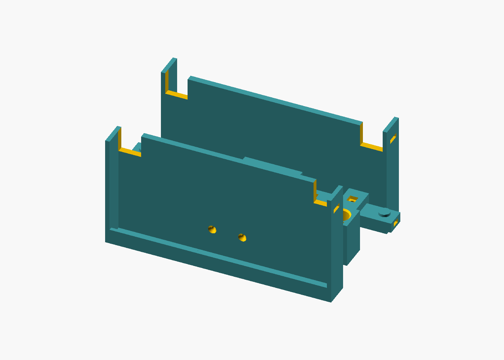
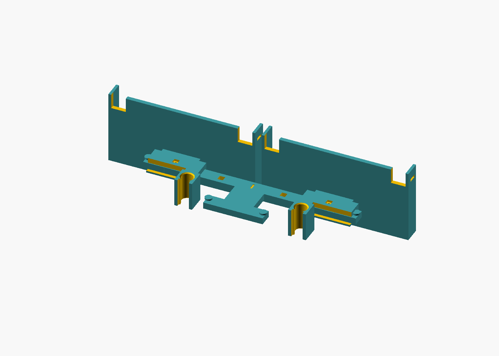
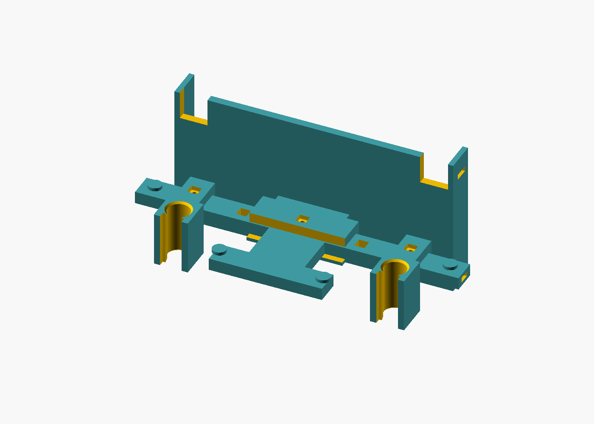
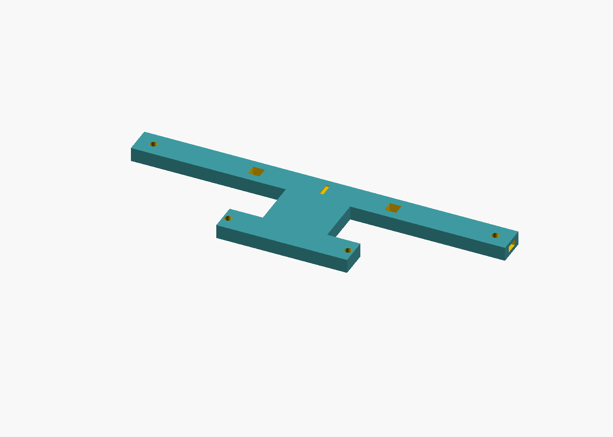
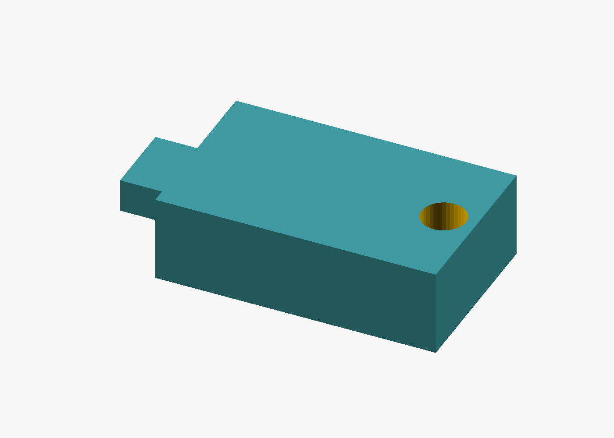
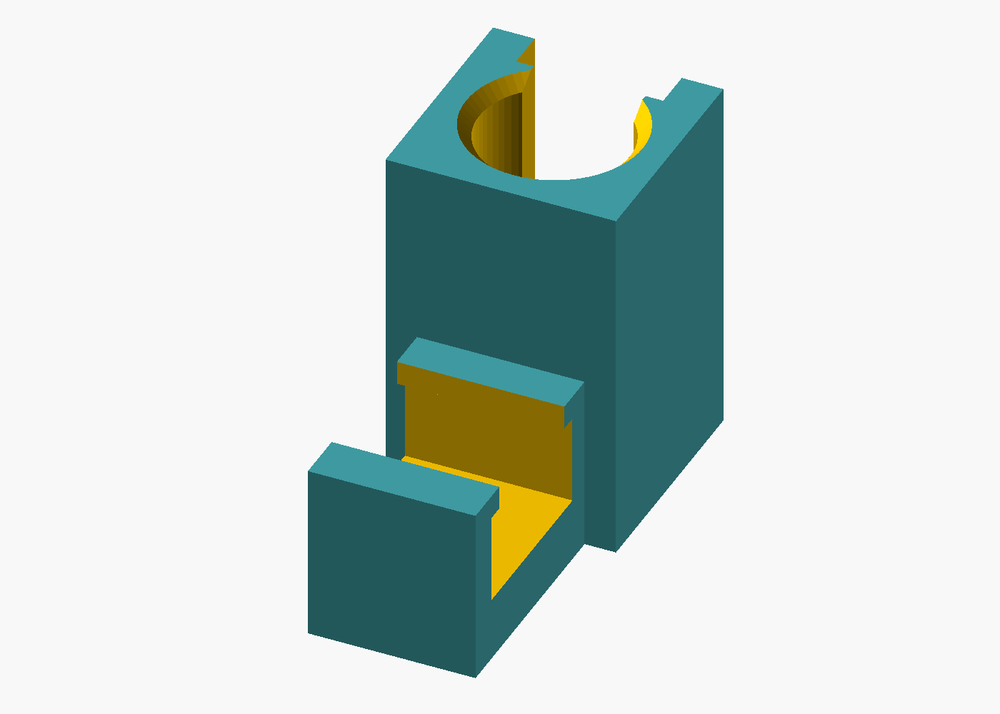
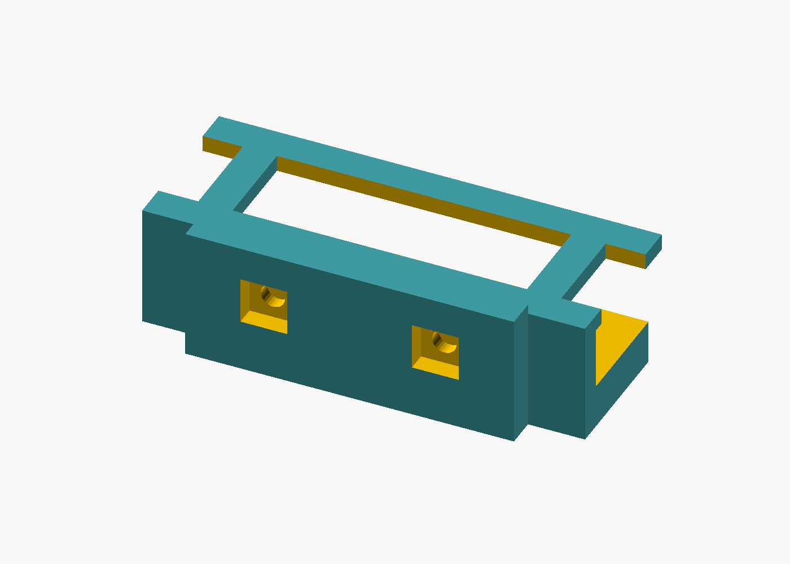
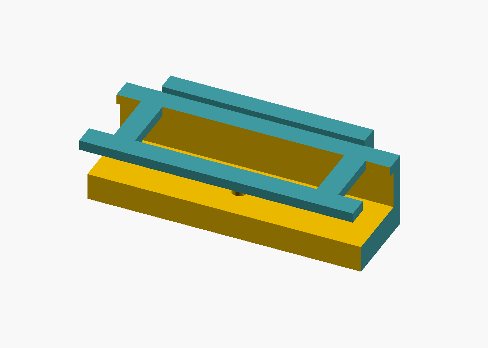
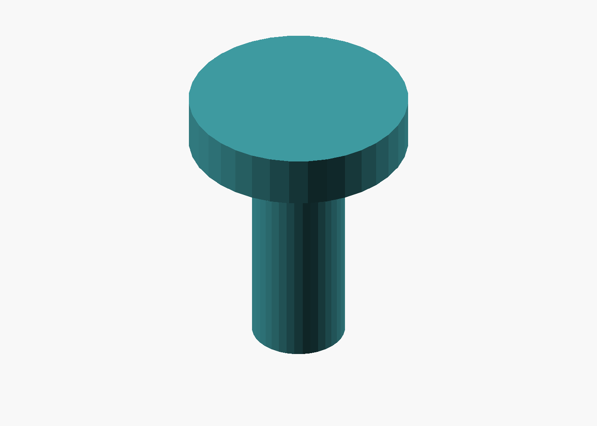

# Headrest phone mount (3D)

**Artifact ID:** ART-RIDE-MOUNT-001  
**Kind:** mechanical-3d  
**Format:** OpenSCAD (source of truth) + generated STL  
**License:** GPL-2.0  
**Version:** 1.0.0 (geometry-verified; not a road release)

Copyright (C) 2026 RideAudit contributors. GPL-2.0-or-later. See [LICENSE](LICENSE) and [NOTICE](NOTICE). Apache-2.0 and MIT are not substitute licenses for this package.

## Purpose

Parametric dual-phone headrest mount for RideAudit rideshare audit capture. It clamps to two vertical headrest posts and holds one or two phones in landscape. The Android client does the recording; this package is only the fixture.

Default layout is **opposed**: one phone faces the road, the other faces the cabin. Set `cradle_layout = 1` for **dual-forward** (both phones face the road) and print the beam extensions.

**Opposed assembly** (default, `part="assembly"`):



**Dual-forward assembly** (`part="assembly_forward"`):



**Single-phone assembly** (`part="assembly_single"`):



## Safety disclaimer

**This mount is not crash-tested and is not a certified automotive restraint, child seat, or OEM accessory.** It is a DIY audit fixture. Do not place it where it can interfere with airbags, the head restraint as the vehicle maker designed it, seatbelt geometry, or the driver's view. Do not cover airbag stitch lines, headliner, or the headrest height lock. If the posts do not hold the clamps firmly, do not use the mount in a moving vehicle. Users assume all risk.

On the default model each cradle projects **57.9 mm** from the post centerline, and the cradle rises **89.8 mm** above the bottom of the clamp. Keep that whole envelope clear of airbags and the headrest pad. Confirm the fit with the checklist in [verification/vehicle-fit-checklist.md](verification/vehicle-fit-checklist.md) before any on-road use. Geometry checks in this repository are CAD checks, not a vehicle test.

## What you print

Print the part STLs in `exports/`. They are already oriented for FDM (flat on the bed). The two `headrest-phone-mount*.stl` files are **assembly previews**, not print files.

| Part | File | Opposed (default) | Dual-forward | Single phone |
| --- | --- | --- | --- | --- |
| Fit coupon (print this first) | `exports/fit-coupon.stl` | 1 | 1 | 1 |
| Beam | `exports/beam.stl` | 1 | 1 | 1 |
| Post clamp | `exports/post-clamp.stl` | 2 | 2 | 2 |
| Phone cradle | `exports/phone-cradle.stl` | 2 | 2 | 1 |
| Cradle clip, road side | `exports/cradle-clip.stl` | 1 | 2 | 1 |
| Cradle clip, cabin side | `exports/cradle-clip-cabin.stl` | 1 | 0 | 0 |
| Stop pin | `exports/stop-pin.stl` | 4 | 2 | 4 |
| Beam extension | `exports/beam-extension.stl` | 0 | 2 (mirror one in the slicer) | 0 |

The default beam is **209.4 mm** long and **8 mm** thick. It needs a printer with at least **220 mm** of travel on one axis. Turn the skirt off and keep the brim on the short side only. If the bed is shorter, lower `post_spacing_max` toward your measured post spacing and re-export; the beam length follows that parameter.

**Beam**



**Beam extension**



**Post clamp**



**Phone cradle**


**Cradle clip, road side**



**Cradle clip, cabin side**



**Stop pin**



**Fit coupon**


## Print settings (starting point)

| Setting | Recommendation |
| --- | --- |
| Material | **PETG** (preferred) or ABS. PLA softens in a closed cabin. |
| Nozzle | 0.4 mm |
| Layer height | 0.2 mm |
| Perimeters | 5 on the clamp, clip, and cradle; 4 elsewhere |
| Infill | 40% gyroid or cubic |
| Top/bottom layers | 5 |
| Supports | None for the part STLs in the exported orientation |
| Bed | Beam along X. Coupon, clamps, clips, cradles, pins, and extensions fit a 180 mm bed; the beam does not. |

The clamp and clip are exported with the rail channel open upward. The retaining lip is a 1.6 mm overhang at the top of that trench. If the lip curls, slow the outer wall to about 20 mm/s. The cradle exports with the back plate on the bed and the pocket open upward; the corner cutouts are the camera windows.

## Measure, then print the coupon

1. **Post spacing.** Center-to-center of the two vertical posts. The default clamp travel covers 110–170 mm. Set `post_spacing_min` about 5 mm under your measurement and `post_spacing_max` about 5 mm over it, then re-export.
2. **Post diameter.** Outside diameter of one post. Set `post_diameter`. The bore is that diameter plus `clearance` (default 0.4 mm). The snap throat is 76% of the post diameter (`throat_ratio` in the Hidden section of the `.scad`).
3. **Print `fit-coupon.stl`.** It is an 18 mm slice of the clamp jaw. It should snap onto the post by hand and then not rattle. If it will not start, raise `throat_ratio` toward 0.82. If it is loose, lower `clearance` toward 0.2.
4. **Phones.** In landscape, length is the long edge and the short side is the vertical edge. Defaults cover length 140–172 mm, short side 70–85 mm, thickness up to 12 mm including a slim case. Measure the cased phone and edit `phone_length_*`, `phone_width_*`, and `phone_thickness_max` if you are outside that envelope.
5. **Camera.** Each cradle has an 18 mm square window in both upper corners of the back plate. Seat the phone so the camera island sits over a window. If the island is larger, increase `camera_clearance` and re-export.
6. **Airbag / headrest.** The mount may touch only the posts. Confirm the 57.9 mm projection and 89.8 mm height miss airbag covers and the headrest release.

Details and the full parameter table: [dimensions.md](dimensions.md).

## Assembly

Hardware is listed in [bom.md](bom.md). Socket-head screws use a 2.5 mm hex key.

1. Slide one road clip onto the main rail from either end, open side toward the center link, until it sits on the notch at mid-rail.
2. Slide one clamp onto each end of the main rail. Do not slide a clamp through the clip.
3. For the opposed layout, slide the cabin clip onto the short stub, open side toward the link.
4. Press a stop pin into each rail hole (four on the opposed beam: two on the main rail, two on the stub). For dual-forward, leave the main-rail end pins out, push an extension tongue into each beam end, and pin the outer end of each extension. Mirror `beam-extension.stl` in the slicer for the second side.
5. Drop an M3 nut into each clip pad (the pocket faces the cradle). Bolt the cradle on with two M3×8 flat-head screws per cradle. Heads sit in the countersinks on the phone side of the back plate.
6. Drop an M3 nut into the hex pocket on top of each clamp and each clip. Run an M3×10 socket screw in until it bears on the rail and the part no longer slides.
7. Snap both clamps onto the headrest posts from the cabin side of the posts. The jaw opening faces the cabin. The fit coupon is the rehearsal for this step.
8. Set the phones in from the top. The front lip keeps them from tipping out. A strip of foam takes up slack when the phone is smaller than the pocket (see below). A cable tie or the velcro strap through the side slots is the backup retainer. Route charge cables through the square holes in the beam.

Foam thickness, per side, when the phone is under the maximum:

- Length: `(phone_length_max - actual length) / 2` against each side wall
- Short side: `phone_width_max - actual short side` under the strap, at the top of the pocket
- Thickness: `phone_thickness_max - actual thickness` against the back plate

## Exporting STL and previews

The `.scad` source is the source of truth under GPL-2.0. From this directory:

```text
./export-stls.sh
./export-previews.sh
```

`export-previews.sh` writes the isometric PNGs under `verification/previews/` (parts, the opposed assembly, the dual-forward assembly, and the single-phone assembly). Same `part=` names as the STL export.

Or one part at a time:

```text
openscad -o exports/beam.stl --export-format binstl -D 'part="beam"' headrest-phone-mount.scad
```

`part` is one of `assembly`, `assembly_forward`, `assembly_single`, `beam`, `extension`, `clamp`, `tray`, `clip`, `clip_cabin`, `pin`, `coupon`.

Check the geometry (pocket, camera windows, post bore, spacing, closed meshes, no clamp/clip interference):

```text
python3 verify-geometry.py
```

That rewrites [verification/geometry-report.md](verification/geometry-report.md). OpenSCAD 2021 or newer is required. A failing assert in the `.scad` file means the parameters cannot satisfy the mount constraints.

## License (GPL-2.0)

```
RideAudit headrest phone mount
Copyright (C) 2026 RideAudit contributors

This program is free software; you can redistribute it and/or
modify it under the terms of the GNU General Public License
as published by the Free Software Foundation; either version 2
of the License, or (at your option) any later version.

This program is distributed in the hope that it will be useful,
but WITHOUT ANY WARRANTY; without even the implied warranty of
MERCHANTABILITY or FITNESS FOR A PARTICULAR PURPOSE.  See the
GNU General Public License for more details.

You should have received a copy of the GNU General Public License
along with this program; if not, see <https://www.gnu.org/licenses/>.
```
