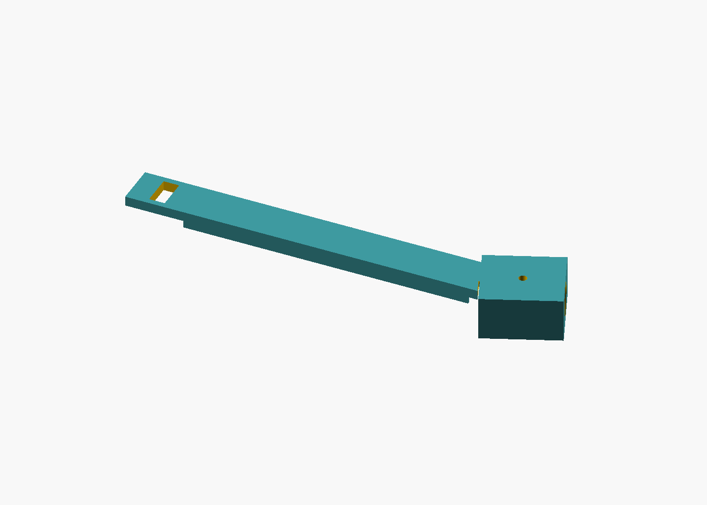

# Headrest phone mount (3D)

**Artifact ID:** ART-RIDE-MOUNT-001  
**Kind:** mechanical-3d  
**Format:** OpenSCAD (source of truth) + generated STL  
**License:** GPL-2.0  
**Version:** 1.0.0 (geometry-verified; not a road release)

Copyright (C) 2026 RideAudit contributors. GPL-2.0-or-later. See [LICENSE](LICENSE) and [NOTICE](NOTICE). Apache-2.0 and MIT are not substitute licenses for this package.

## Purpose

One landscape phone, held on the face of a headrest. Two post blocks, one per post. The post passes through the block. Each block has a 200 mm arm. Both arms slide into one receiver on a single cradle. A slot across each arm lets one M5 thumbscrew pass through both arms into a tapped hole in the solid back of the cradle.

The flat heel of each block and the flat back of the cradle are the same plane. They sit flush on the headrest pad. The phone sits in the cradle against that back plate. Nothing in this package is a second cradle, a shared rail, or a sliding clip.

The blocks pivot on the posts. A 5×3 grid of M5 holes, 10 mm apart, is the discrete lock: swing the arms until both slots line up on the same hole, then tighten.


## Safety disclaimer

**This mount is not crash-tested and is not a certified automotive restraint, child seat, or OEM accessory.** It is a DIY audit fixture. Do not place it where it can interfere with airbags, the head restraint as the vehicle maker designed it, seatbelt geometry, or the driver's view. Do not cover airbag stitch lines, the headliner, or the headrest height lock. If the posts or the pad do not hold the blocks firmly, do not use the mount in a moving vehicle. Users assume all risk.

On the default model the blocks and the cradle stand **22.4 mm** off the headrest face, and the cradle top is **307 mm** above the bottom of the blocks. That whole footprint has to stay clear of airbags and the headrest release. Slide the blocks on the posts so the cradle lands on the pad, with the camera windows at or past the cushion edge if the phone cameras face the pad. Confirm the fit with [verification/vehicle-fit-checklist.md](verification/vehicle-fit-checklist.md) before any on-road use. Geometry checks in this repository are CAD checks, not a vehicle test.

## What you print

Print the part STLs in `exports/`. `headrest-phone-mount.stl` is an assembly preview, not a print file.

| Part | File | Qty | Notes |
| --- | --- | --- | --- |
| Fit coupon (print this first) | `exports/fit-coupon.stl` | 1 | 18 mm slice of the round post bore |
| Post block, inner arm | `exports/post-block.stl` | 1 | Arm lies against the cradle plate. Snap off the print rib. |
| Post block, outer arm | `exports/post-block-outer.stl` | 1 | Arm stacks on the inner arm. Snap off the print rib. |
| Phone cradle | `exports/phone-cradle.stl` | 1 | Shared landscape holder, receiver, and M5 hole grid |

The post blocks are **225 mm** long. They need about **230 mm** of travel on one axis. The cradle is **180.4 × 159.8 × 21.5 mm**.

**Post block, inner arm**


**Post block, outer arm**



**Phone cradle**


**Fit coupon**


Each post-block STL has a 1.1 mm rib under the arm. It only exists so the arm prints without slicer support. Snap or cut it off before the block goes on the post. The rib is not in the assembly model.

## Print settings (starting point)

| Setting | Recommendation |
| --- | --- |
| Material | **PETG** (preferred) or ABS. PLA softens in a closed cabin. |
| Nozzle | 0.4 mm |
| Layer height | 0.2 mm |
| Perimeters | 5 on the post blocks and the cradle; 4 on the coupon |
| Infill | 40% gyroid or cubic |
| Top/bottom layers | 5 |
| Supports | None. The post-block rib is the support; remove it after printing. |
| Bed | Heel of the block down. Cradle back plate down, pocket up. Coupon bore vertical. |

The block bore is a circle plus a small teardrop toward the front face so the horizontal hole does not need support. The round part of that hole is the post size. The fit coupon is a true round bore; use it to judge the diameter, not the teardrop.

The cradle back is 6 mm thick. The hole grid is modeled at the M5×0.8 tap-drill diameter (4.2 mm). Chase every hole you might use with an M5 tap before assembly. The plastic thread is the lock; there is no nut pocket.

## Measure, then print the coupon

1. **Post spacing.** Center-to-center of the two posts. The arms can meet for spacings from 110 mm to 170 mm. Set `post_spacing` to your measurement and re-export so the preview angle matches the car. The blocks themselves are independent; spacing is not a slot in a rail.
2. **Post diameter.** Outside diameter of one post. Set `post_diameter`. The bore is that diameter plus `clearance` (default 0.4 mm).
3. **Print `fit-coupon.stl`.** Slide it onto the post. The headrest may have to come out of the seat if the posts are captive. The coupon should start by hand and should not rattle. If it is tight, raise `clearance` toward 0.6 mm. If it is loose, lower `clearance` toward 0.2 mm.
4. **Phone, landscape.** Long edge is `phone_length_*` (140–172 mm). Short edge, the vertical one, is `phone_width_*` (70–85 mm). Thickness including a slim case is `phone_thickness_max` (up to 12 mm).
5. **Camera.** 18 mm square windows in both upper corners of the back plate. If the phone cameras face the pad, put those windows at the edge of the cushion so the lenses are not buried in foam. If the cameras face outward, the windows keep a corner camera bump off the plastic.
6. **Airbag / headrest.** The mount may bear on the posts and on the headrest face. It may not bear on an airbag cover. Keep the 22.4 mm stand-off and the 307 mm height off airbag covers and the height lock.

Details: [dimensions.md](dimensions.md).

## Assembly

Hardware is listed in [bom.md](bom.md).

1. Snap the print rib off both post blocks.
2. Slide each block onto a post until the flat heel is flush on the headrest pad. The inner-arm block is the one whose arm will lie against the cradle plate. The outer-arm block stacks on top of it.
3. Hold the cradle flat on the same pad. Swing both arms along the pad until both width-slots expose the same hole in the grid.
4. Run one M5×20 thumbscrew through both slots into that hole. Tighten until the arms and the cradle cannot shift. The screw clamps in tension into the solid back.
5. Run an M5 pinch screw into the front of each block until it bears on the post. That stops the block rotating after you have picked the hole.
6. Set the phone in from the top. The back of the phone sits on the back plate. The front lip keeps it from tipping out. A strap through the side slots is the backup retainer.

Foam thickness, per side, when the phone is under the maximum:

- Length: `(phone_length_max - actual length) / 2` against each side wall
- Short side: `phone_width_max - actual short side` under the strap, at the top of the pocket
- Thickness: `phone_thickness_max - actual thickness` against the back plate

To move the phone, loosen the thumbscrew, pivot the blocks until the slots meet a different hole, and retighten. The grid is 10 mm in both directions. Then snug the pinch screws again.

## Exporting STL and previews

The `.scad` source is the source of truth under GPL-2.0. From this directory:

```text
./export-stls.sh
./export-previews.sh
```

`export-previews.sh` writes the isometric PNGs under `verification/previews/` for both post blocks, the cradle, the fit coupon, and the complete assembly.

Or one part at a time:

```text
openscad -o exports/post-block.stl --export-format binstl -D 'part="block"' headrest-phone-mount.scad
```

`part` is one of `assembly`, `block`, `block_outer`, `tray`, `coupon`.

Check the geometry (pocket, camera windows, post bore, arm slots, hole grid, flush faces, no arm interference):

```text
python3 verify-geometry.py
```

That rewrites [verification/geometry-report.md](verification/geometry-report.md). OpenSCAD 2021 or newer is required. A failing assert in the `.scad` file means the parameters cannot satisfy the mount constraints.

## License (GPL-2.0)

```
RideAudit headrest phone mount
Copyright (C) 2026 RideAudit contributors

This program is free software; you can redistribute it and/or
modify it under the terms of the GNU General Public License
as published by the Free Software Foundation; either version 2
of the License, or (at your option) any later version.

This program is distributed in the hope that it will be useful,
but WITHOUT ANY WARRANTY; without even the implied warranty of
MERCHANTABILITY or FITNESS FOR A PARTICULAR PURPOSE.  See the
GNU General Public License for more details.

You should have received a copy of the GNU General Public License
along with this program; if not, see <https://www.gnu.org/licenses/>.
```
