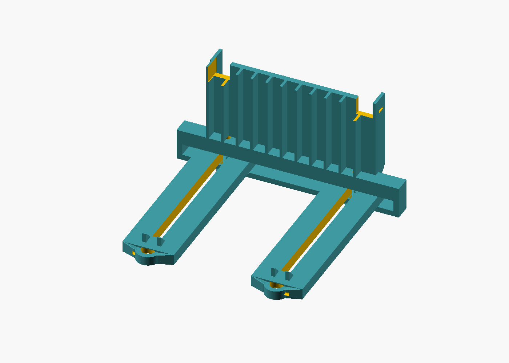
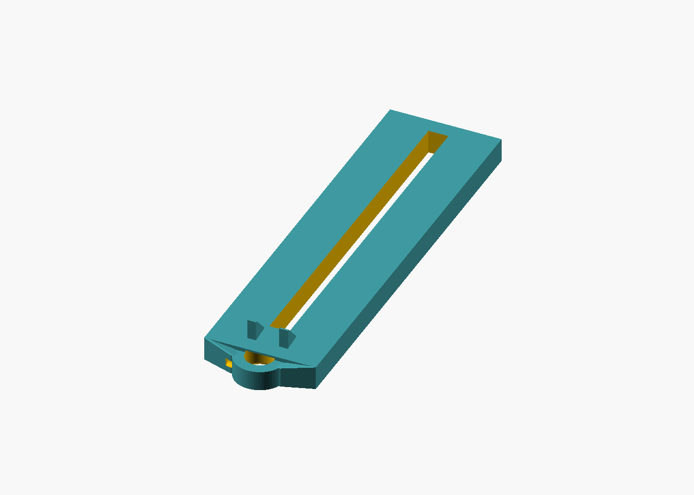
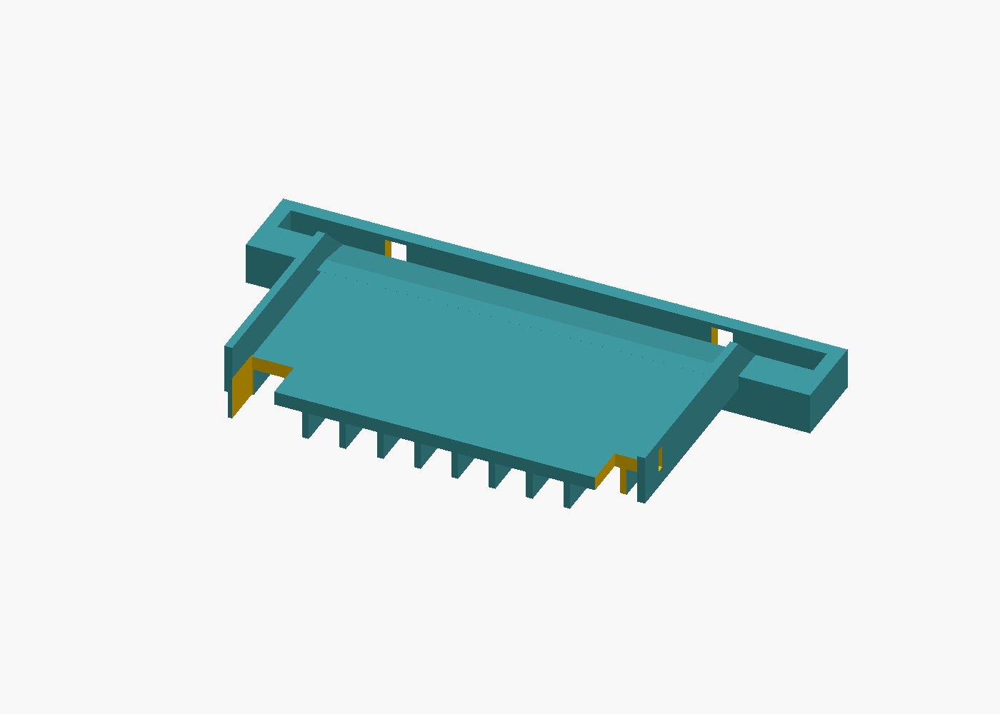
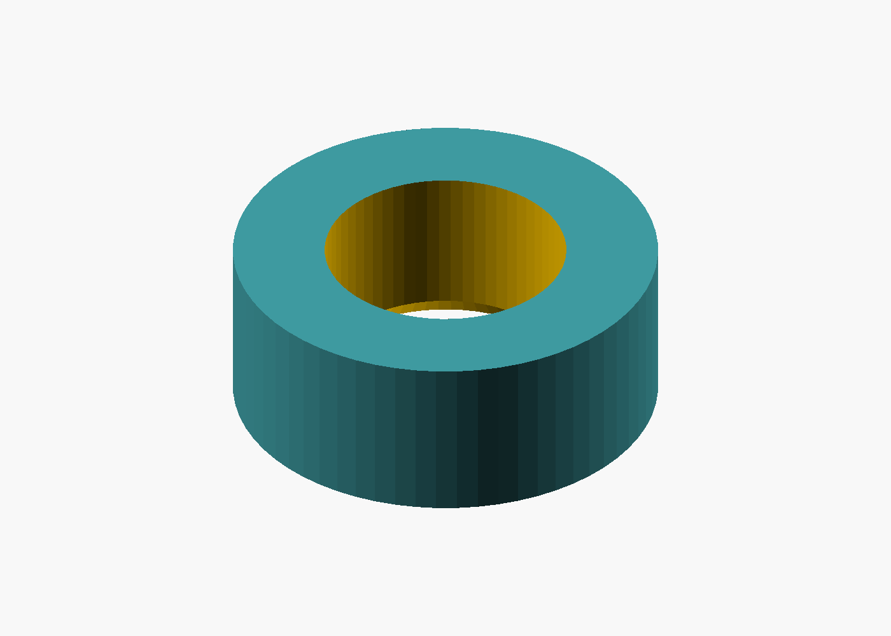
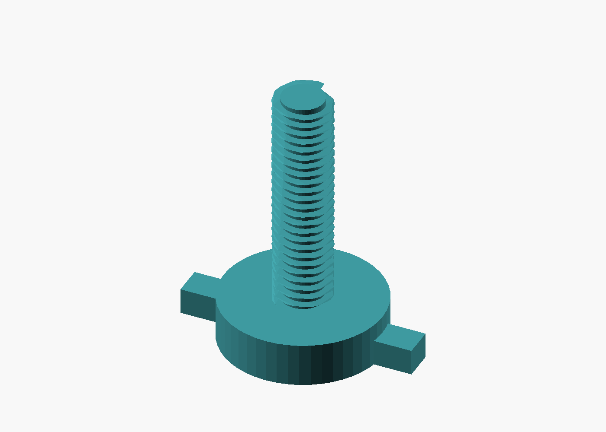

# Headrest phone mount (3D)

**Artifact ID:** ART-RIDE-MOUNT-001  
**Kind:** mechanical-3d  
**Format:** OpenSCAD (source of truth) + generated STL  
**License:** GPL-2.0  
**Version:** 1.0.0 (geometry-verified; not a road release)

Copyright (C) 2026 RideAudit contributors. GPL-2.0-or-later. See [LICENSE](LICENSE) and [NOTICE](NOTICE). Apache-2.0 and MIT are not substitute licenses for this package.

## Purpose

One landscape phone, held on a vertical plate. Two post blocks, one per post. Each block is one round collar, 14.5 mm inside, 25.5 mm outside, and 10 mm thick. The rear of the collar is tangent to the headrest pad. Each collar carries a 200 mm arm in a horizontal plane, with gussets at the joint. Both arms slide into one shared cradle from the rear. Each arm has a longitudinal slot 10 mm wide, 1 mm clear of the M8 crest on each side, so the cradle can slide forward or back to set how far the phone sits from the pad. Its own M8×1.25 thumbscrew comes up from below, on that arm's centerline, through a slot in the cradle bottom, through that arm slot, and into a tap hole in the receiver roof. Fully seated, the head face clamps the bottom plate and the arm.

The phone sits flush on the forward face of the vertical plate. Nothing in this package is a second cradle, a shared rail, a sliding clip, or an arm that rises toward the phone.

The blocks are independent. Set `post_spacing` to the measured center distance (110–170 mm) and re-export so each arm's tap hole sits on that arm. The longitudinal slot is only the depth lock: it is too tight to reach a neighboring hole.



## Safety disclaimer

**This mount is not crash-tested and is not a certified automotive restraint, child seat, or OEM accessory.** It is a DIY audit fixture. Do not place it where it can interfere with airbags, the head restraint as the vehicle maker designed it, seatbelt geometry, or the driver's view. Do not cover airbag stitch lines, the headliner, or the headrest height lock. If the posts or the pad do not hold the blocks firmly, do not use the mount in a moving vehicle. Users assume all risk.

On the default model the collar rears are tangent to the pad, the arms run **200 mm** forward from the post axes, and the phone's front face is **222.2 mm** forward of the pad. The top of the cradle is **114.0 mm** above the bottom of the blocks. That forward reach has to stay clear of the driver, airbags, and the headrest release. Confirm the fit with [verification/vehicle-fit-checklist.md](verification/vehicle-fit-checklist.md) before any on-road use. Geometry checks in this repository are CAD checks, not a vehicle test.

## What you print

Print the part STLs in `exports/`. `headrest-phone-mount.stl` is an assembly preview, not a print file. Print `post-block.stl` twice; both blocks are the same part.

| Part | File | Qty | Notes |
| --- | --- | --- | --- |
| Fit coupon (print this first) | `exports/fit-coupon.stl` | 1 | The same 14.5 / 25.5 × 10 mm collar, without the arm |
| Post block | `exports/post-block.stl` | 2 | Round collar, horizontal arm, root gussets. |
| Phone cradle | `exports/phone-cradle.stl` | 1 | Shared landscape holder. Arms enter from the rear. Bottom slots line up with the roof threads. |
| Thumbscrew | `exports/thumbscrew.stl` | 2 | Modeled M8×1.25 thumbscrew with an external thread. Shown in the assembly. Metal M8×30 is the hardware match. |

The post block prints **56.0 × 212.8 × 22.0 mm**. The 22 mm height is the arm plus the 10 mm root gussets; the collar itself is 10 mm thick. It needs about **215 mm** of travel on one axis. The cradle is **242.0 × 120.2 × 33.5 mm** and needs about **250 mm** on one axis. The fit coupon is **25.5 × 25.5 × 10.0 mm**. The thumbscrew is **32.0 × 22.0 × 36.5 mm**.

**Post block**



**Phone cradle**



**Fit coupon**



**Thumbscrew**



## Print settings (starting point)

| Setting | Recommendation |
| --- | --- |
| Material | **PETG** (preferred) or ABS. PLA softens in a closed cabin. |
| Nozzle | 0.4 mm |
| Layer height | 0.2 mm |
| Perimeters | 5 on the post blocks and the cradle; 4 on the coupon |
| Infill | 40% gyroid or cubic |
| Top/bottom layers | 5 |
| Supports | None. The cradle pocket overhangs at 45°. |
| Bed | Block: arm and heel down, bore vertical. Cradle: rear edge down (bottom and roof stand as walls). Thumbscrew: head and wings down, shank up. Coupon: bore vertical. |

The block bore is a round vertical hole. The fit coupon is the same round bore; use it to judge the diameter.

The receiver roof carries the M8 threads. Holes are modeled at the M8×1.25 tap-drill diameter (6.8 mm). The thumbscrew STL carries a modeled external thread (crest Ø 8 mm, pitch 1.25 mm). Chase every hole you might use with an M8×1.25 tap before assembly. The plastic thread is the lock; there is no nut pocket. Pinch screws in the post blocks stay M5.

## Measure, then print the coupon

1. **Post spacing.** Center-to-center of the two posts, from 110 mm to 170 mm. Set `post_spacing` and re-export. Each cradle is cut for one spacing: the arm slot has only 1 mm of side clearance, so it cannot slide onto a different hole.
2. **Post diameter.** The bore is fixed at 14.5 mm so a 14 mm post has 0.5 mm of diametral clearance. Measure the post. A post larger than 14 mm will not enter. A smaller post will be loose until the pinch screw is tightened. Sources and the size chart are in [dimensions.md](dimensions.md).
3. **Print `fit-coupon.stl`.** Slide it onto the post. The headrest may have to come out of the seat if the posts are captive. It should start by hand on a 14 mm post. If the post is much smaller, the pinch screw, not a tighter bore, is what stops the rattle.
4. **Phone, landscape.** Long edge is `phone_length_*` (140–172 mm). Short edge, the vertical one, is `phone_width_*` (70–85 mm). Thickness including a slim case is `phone_thickness_max` (up to 12 mm).
5. **Camera.** 18 mm square windows in both upper corners of the back plate. If the phone cameras face the pad, put those windows at the edge of the cushion so the lenses are not buried in foam. If the cameras face outward, the windows keep a corner camera bump off the plastic.
6. **Airbag / headrest.** The mount bears on the posts and on the headrest face at the back of each collar. It may not bear on an airbag cover. Keep the 222.2 mm forward reach and the 114.0 mm height off airbag covers, the driver, and the height lock.

Details: [dimensions.md](dimensions.md).

## Assembly

Hardware is listed in [bom.md](bom.md).

1. Slide each collar onto a post until its rear is against the headrest pad. Print the same STL twice.
2. Slide both horizontal arms into the cradle from the rear, between the bottom plate and the roof. The phone plate stays vertical. Slide the cradle along the longitudinal slots until the phone is the depth you want.
3. From below, run one thumbscrew up through the cradle-bottom slot, through that arm's slot, and into the tapped hole the slot exposes. Tighten until the head face is seated on the cradle bottom. Each screw clamps only its own arm. The modeled screw is `thumbscrew.stl`; a metal M8×30 matches the 30.5 mm shank. A longer screw can break out of the 16 mm roof.
4. Run an M5 pinch screw through the outboard side of each collar until it bears on the post. The collar is only 10 mm thick, so the pinch is radial, not from the top. That stops the block rotating.
5. Set the phone in from the top. The back of the phone sits flush on the vertical plate. The front lip keeps it from tipping out. A strap through the side slots is the backup retainer.

Foam thickness, per side, when the phone is under the maximum:

- Length: `(phone_length_max - actual length) / 2` against each side wall
- Short side: `phone_width_max - actual short side` under the strap, at the top of the pocket
- Thickness: `phone_thickness_max - actual thickness` against the back plate

To move the phone closer to the pad or farther out, loosen the two thumbscrews and slide the cradle along the arm slots, then retighten. Sideways position is the `post_spacing` you exported, not a second hole. Then snug the pinch screws again.

## Clamp stack

Fully seated means the head bearing face is against the underside of the cradle bottom. The CAD model leaves a 0.12 mm gap there so the meshes do not share a face; that gap is not looseness in the clamp.

| Member | mm |
| --- | --- |
| Cradle bottom plate | 6 |
| Arm | 12 |
| Clamped stack | 18 |
| Slide clearance taken up (0.20 under the arm and 0.20 over it) | 0.40 |
| Thread left in the 16 mm roof | 12 |
| Head bearing face | Ø 22 |
| Bottom clearance slot | 9.0 wide × 14 along the arm |
| Roof hole | 6.8 tap drill; the Ø 8 crest bites that wall |
| Shank under the face | 30.5 |

There is one bottom slot per arm, so the Ø 22 face bears on the plate around that 9 mm slot. The cheeks hold the channel at a fixed height, so the 0.40 mm is the seating take-up. Each arm rail beside the 10 mm slot is 23 mm wide and 12 mm thick. Two ribs at the collar rise 10 mm above the arm and taper off before the slot.

## Exporting STL and previews

The `.scad` source is the source of truth under GPL-2.0. From this directory:

```text
./export-stls.sh
./export-previews.sh
```

`export-previews.sh` writes the isometric PNGs under `verification/previews/` for the post block, the cradle, the fit coupon, the thumbscrew, and the complete assembly.

Or one part at a time:

```text
openscad -o exports/post-block.stl --export-format binstl -D 'part="block"' headrest-phone-mount.scad
```

`part` is one of `assembly`, `block`, `tray`, `coupon`, `screw`.

Check the geometry (pocket, camera windows, 14.5 mm bore, rear entry, tight arm slots, root gussets, cradle-bottom slots, modeled thumbscrews, flush heels, no arm interference):

```text
python3 verify-geometry.py
```

That rewrites [verification/geometry-report.md](verification/geometry-report.md). OpenSCAD 2021 or newer is required. A failing assert in the `.scad` file means the parameters cannot satisfy the mount constraints.

## License (GPL-2.0)

```
RideAudit headrest phone mount
Copyright (C) 2026 RideAudit contributors

This program is free software; you can redistribute it and/or
modify it under the terms of the GNU General Public License
as published by the Free Software Foundation; either version 2
of the License, or (at your option) any later version.

This program is distributed in the hope that it will be useful,
but WITHOUT ANY WARRANTY; without even the implied warranty of
MERCHANTABILITY or FITNESS FOR A PARTICULAR PURPOSE.  See the
GNU General Public License for more details.

You should have received a copy of the GNU General Public License
along with this program; if not, see <https://www.gnu.org/licenses/>.
```
