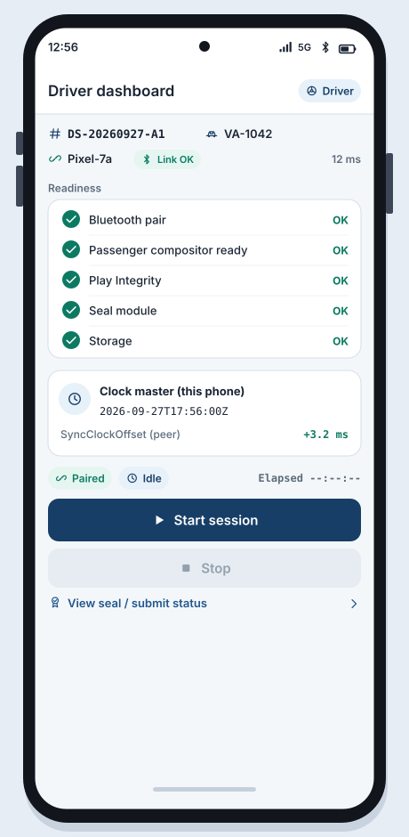
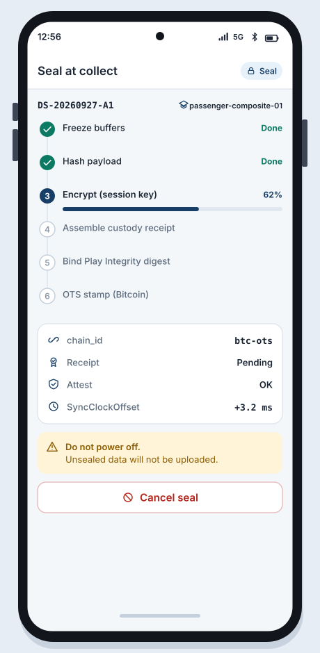

# SB-02 Driver coordinate

**Artifact:** ART-RIDE-UX-001  
**FR links:** FR-RIDE-054, FR-RIDE-042, FR-RIDE-025  
**Screens:** [WF-04](../../assets/wireframes/WF-04-driver-dashboard.svg), [WF-06](../../assets/wireframes/WF-06-seal-progress.svg), [WF-07](../../assets/wireframes/WF-07-submit-status.svg), [WF-08](../../assets/wireframes/WF-08-fail-closed-errors.svg)

## Goal

The driver phone owns session start/stop, shared clock mastership, admission readiness checks, and submission orchestration for the paired DualPhoneSession.

## Actors

- Driver (coordinator)
- Passenger phone (peer, receives commands)
- Play Integrity attestation service
- Public sealed-submit API (later SB-05)

## Beats

1. **Dashboard idle (paired)**  
   Driver dashboard shows: role badge Driver, peer connected, SyncClockOffset to passenger, Play Integrity OK/FAIL chip, vehicle id, session id, Start Session (disabled until readiness green).

   

   [Open WF-04-driver-dashboard.svg](../../assets/wireframes/WF-04-driver-dashboard.svg)

2. **Readiness gate**  
   Coordinator runs preflight: BT link healthy, passenger compositor ready, attestation fresh, seal module ready, storage free. Any red item blocks Start (fail-closed).

   

   [Open WF-04-driver-dashboard.svg](../../assets/wireframes/WF-04-driver-dashboard.svg)

   Fail-closed branch:

   

   [Open WF-08-fail-closed-errors.svg](../../assets/wireframes/WF-08-fail-closed-errors.svg)

3. **Start session**  
   Driver taps Start. Driver phone publishes session clock epoch and START command over the paired link. Recording indicators go live on both phones.

   

   [Open WF-04-driver-dashboard.svg](../../assets/wireframes/WF-04-driver-dashboard.svg)

4. **Active coordination**  
   Dashboard shows elapsed time, link latency, passenger composite health, and Stop. Driver does not composite video; that stays on the passenger phone (SB-03).

   

   [Open WF-04-driver-dashboard.svg](../../assets/wireframes/WF-04-driver-dashboard.svg)

5. **Stop and handoff to seal**  
   Driver taps Stop. Coordinator issues STOP, freezes clock epoch for seal, and routes both phones into seal-at-collect (SB-04). Driver then orchestrates submit admission (SB-05).

   Seal progress:

   

   [Open WF-06-seal-progress.svg](../../assets/wireframes/WF-06-seal-progress.svg)

## Success criteria

- Only the driver-role phone may start or stop an admitted dual-phone session after pairing.
- Driver phone publishes session clock and coordination commands to the passenger phone.
- Failed Play Integrity or readiness keeps Start disabled.

## Notes

Driver coordinates; passenger composites. Separation is intentional for evidence clarity.
