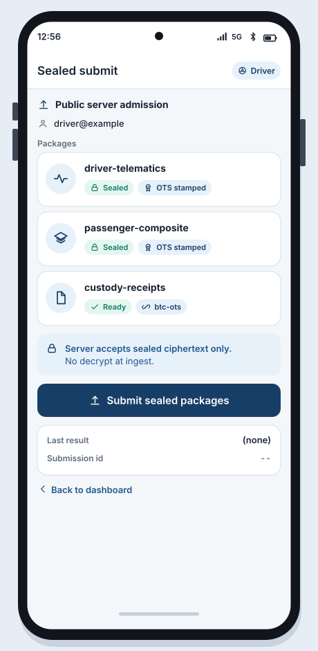
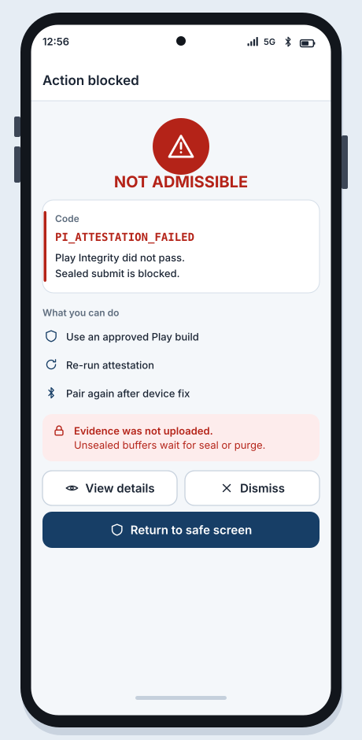
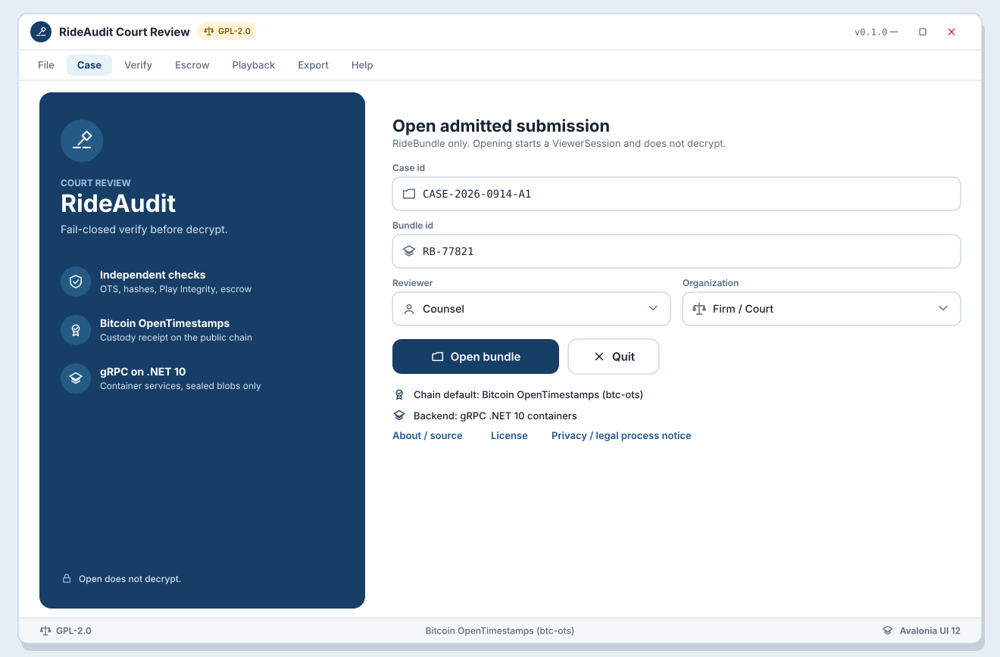

# SB-05 Submit admission

**Artifact:** ART-RIDE-UX-001  
**FR links:** FR-RIDE-035, FR-RIDE-036, FR-RIDE-026, FR-RIDE-032, FR-RIDE-039  
**Screens:** [WF-07](../../assets/wireframes/WF-07-submit-status.svg), [WF-08](../../assets/wireframes/WF-08-fail-closed-errors.svg)
**API:** ART-RIDE-API-001 (sealed-only)

## Goal

Driver phone orchestrates submission of sealed packages to the public RideAudit server. Server admits only sealed ciphertext plus valid custody/attestation chain. Fail-closed on Play Integrity failure, missing seal, or incomplete OTS/receipt policy.

## Actors

- Driver (submit orchestrator)
- Passenger phone (supplies sealed local artifacts over pair or shared handoff)
- Public sealed-submission API
- Admission verifier (integrity, attestation, receipt policy)

## Beats

1. **Pre-submit checklist**  
   Submit status screen (WF-07) lists packages: driver telematics/video fragments, passenger composite, receipts. Each row shows sealed Y/N, Play Integrity OK/FAIL, OTS status.

   

   [Open WF-07-submit-status.svg](../../assets/wireframes/WF-07-submit-status.svg)

2. **Submit**  
   Driver taps Submit Sealed. Client uploads sealed blobs only (no decrypt at ingest). Auth is driver-account bearer (placeholder scheme per API artifact).

   

   [Open WF-07-submit-status.svg](../../assets/wireframes/WF-07-submit-status.svg)

3. **Admission result**  
   Server returns admit / reject with reason codes. UI maps rejects to fail-closed copy (WF-08): attestation failed, seal missing, receipt incomplete, abuse throttle, etc.

   Reject:

   

   [Open WF-08-fail-closed-errors.svg](../../assets/wireframes/WF-08-fail-closed-errors.svg)

   Submit status:

   

   [Open WF-07-submit-status.svg](../../assets/wireframes/WF-07-submit-status.svg)

4. **Admitted**  
   Show submission id, server receipt ack, and link to counsel viewer path (SB-06). GPL-2.0 notice remains visible in about/footer.

   

   [Open WF-07-submit-status.svg](../../assets/wireframes/WF-07-submit-status.svg)

   Counsel viewer handoff:

   

   [Open WF-R-01-splash-case-open.svg](../../assets/wireframes/WF-R-01-splash-case-open.svg)

## Success criteria

- Only sealed payloads are accepted.
- Failed Play Integrity rejects admission.
- Driver coordinates multi-package submit for the DualPhoneSession.

## Notes

Public crowdsourced evidence network posture: any driver account may submit sealed data for their own vehicles/routes. Multi-tenant isolation applies server-side.
