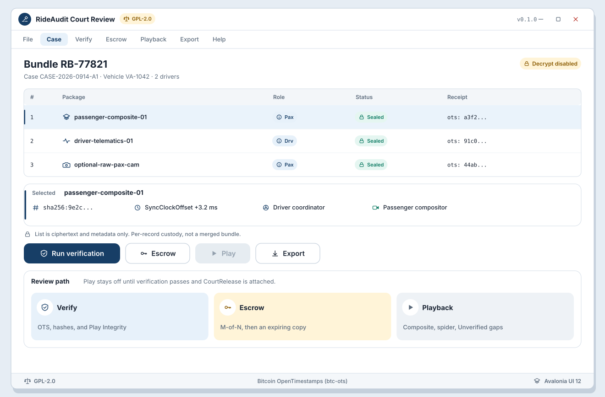
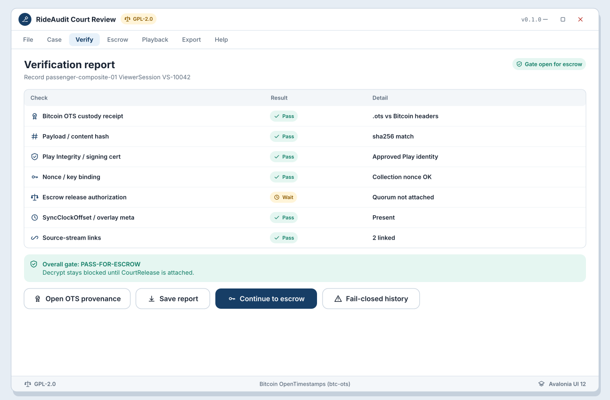
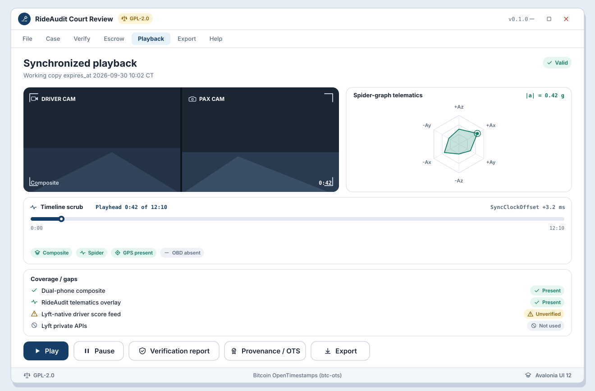
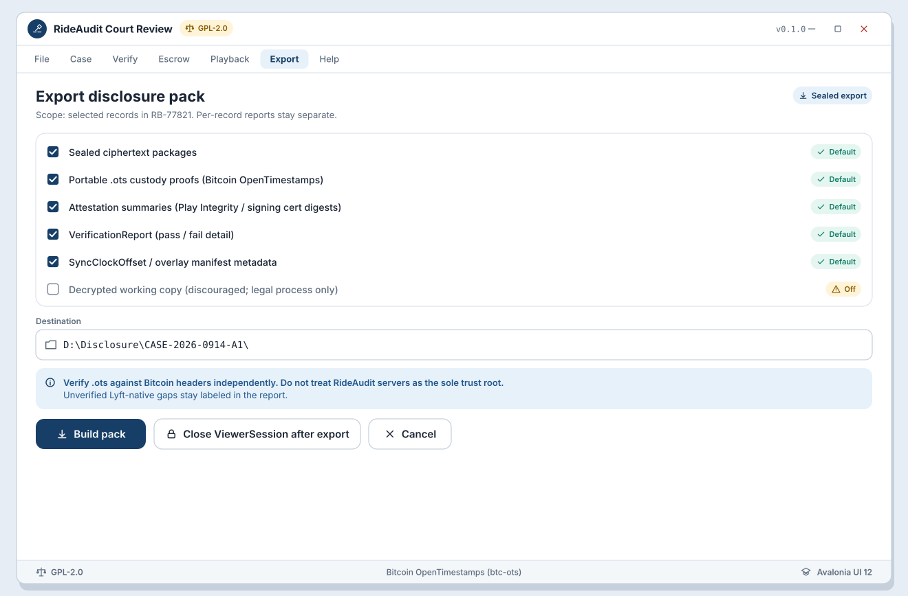

# SB-06 Counsel viewer overview

**Artifact:** ART-RIDE-UX-001 (overview only)  
**Detailed desktop ART:** **ART-RIDE-UX-REVIEW-001** (`docs/ux/review-app/`)  
**FR links:** FR-RIDE-049, FR-RIDE-050, FR-RIDE-047, FR-RIDE-052, FR-RIDE-017, FR-RIDE-018, FR-RIDE-045  
**Surfaces:** Desktop court/counsel viewer (Avalonia UI 12; not Android primary); referenced from mobile submit success

## Goal

Counsel and auditors review sealed dual-phone evidence with provenance: seal metadata, Play Integrity attestation summary, Bitcoin OTS custody receipt, SyncClockOffset, composite with spider-graph overlay, and escrow/decryption path status (no casual plaintext).

## Actors

- Counsel / Auditor
- Desktop viewer application (Avalonia UI 12)
- Escrow / dual-control release process (legal process; not in-app casual decrypt)
- gRPC .NET 10 backend services (containers)

## Beats

1. **Open submission**  
   Viewer loads admitted submission by id. Shows driver/passenger roles, vehicle id, session clock epoch, and package list.

   

   [Open WF-R-01-splash-case-open.svg](../../assets/wireframes/WF-R-01-splash-case-open.svg)

   Sealed package list:

   

   [Open WF-R-02-bundle-contents.svg](../../assets/wireframes/WF-R-02-bundle-contents.svg)

2. **Provenance panel**  
   For each package: content hash, seal timestamp, attestation result, OTS proof status (verify against Bitcoin headers), collector_id. Failures flagged; incomplete proofs not presented as court-ready.

   

   [Open WF-R-07-provenance-custody-ots.svg](../../assets/wireframes/WF-R-07-provenance-custody-ots.svg)

   Verification report:

   

   [Open WF-R-03-verification-report.svg](../../assets/wireframes/WF-R-03-verification-report.svg)

   Fail-closed branch:

   

   [Open WF-R-04-fail-closed-blocking.svg](../../assets/wireframes/WF-R-04-fail-closed-blocking.svg)

3. **Composite review**  
   Playback of sealed composite (after lawful decrypt path) with telematics overlay visible as captured. Spider graph timeline scrubbable against shared clock.

   

   [Open WF-R-06-synchronized-playback.svg](../../assets/wireframes/WF-R-06-synchronized-playback.svg)

4. **Coverage / gaps**  
   Coverage matrix and Unverified caveats from requirements remain visible where Lyft-native signals are absent. No invented Lyft APIs.

   

   [Open WF-R-06-synchronized-playback.svg](../../assets/wireframes/WF-R-06-synchronized-playback.svg)

5. **Export for disclosure**  
   Export sealed package + portable `.ots` + attestation summary for opposing counsel independent check.

   

   [Open WF-R-08-export-opposing-counsel.svg](../../assets/wireframes/WF-R-08-export-opposing-counsel.svg)

## Success criteria

- Viewer surfaces dual-phone roles and composite as first-class evidence.
- Public OTS verification path is explainable without trusting RideAudit servers alone.
- Decryption follows escrow/legal process; viewer does not imply casual plaintext access.

## Notes

This storyboard is an overview handoff from the mobile capture ART. **Detailed counsel workflow, storyboards (SB-R-01 .. SB-R-06), and wireframes (WF-R-01 .. WF-R-08) live in `ART-RIDE-UX-REVIEW-001`** at `docs/ux/review-app/`. That ART requires fail-closed independent verification (Bitcoin OTS primary, hashes, Play Integrity binding, escrow auth) before decrypt or display.
