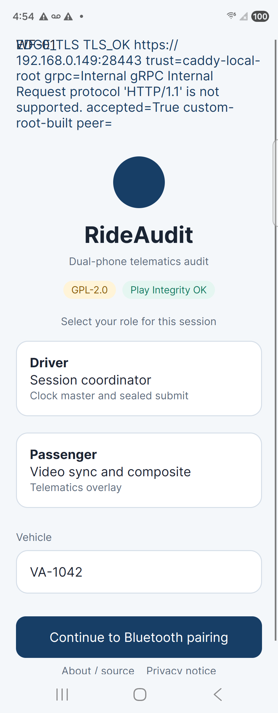

# Dual-phone Caddy edge TLS

TimestampUtc: 2026-09-29T21:54:40Z

The Samsung Fold 4 opened the debug RideAudit app to `https://192.168.0.149:28443` and completed a TLS handshake to the Caddy local root. Admission `Health` then failed. The Motorola edge 2024 was not installed: wireless adb refused the connection. This is not a Caddy closure, an OTS result, a hardware HSM result, or a Play publication.

## Fold 4

- Serial: `RFCW7078MVZ`
- Model: `SM_F936U`
- Transport: USB adb
- Package: `org.rideaudit.app` debug APK, incremental install Success in 6271 ms
- Endpoint: `https://192.168.0.149:28443`
- Counsel: the capture client has no counsel RPC. Log line: `counsel=not-configured`. Port 28444 was not called.
- Path: startup `CaptureAdmissionChannel.ProbeEdgeTls` calls admission `Health`. Stop and submit still fail closed before `SubmitSealed` because camera, Play, and HSM are missing.
- TLS: `accepted=True custom-root-built`
- gRPC: `Internal`, detail `Request protocol 'HTTP/1.1' is not supported.`
- Screen text on `EdgeTlsText`, bounds `[52,119][852,424]`: `EDGE_TLS TLS_OK https://192.168.0.149:28443 trust=caddy-local-root grpc=Internal gRPC Internal Request protocol 'HTTP/1.1' is not supported. accepted=True custom-root-built peer=`
- The UI dump and logcat do not contain `:28080`, `:28081`, or `ngrok`.

An earlier install on the same phone, before the Caddy intermediate was added to the trust extras, logged `accepted=False custom-root-rejected PartialChain`. That attempt is not the result above.

Screenshot SHA256 `F9BFC4EE53400201AFEB535501D2CAD6FE6709AEA53A803783061950C7980A1B` (222051 bytes, PNG magic `89 50 4E 47`). Logcat SHA256 `242F8E049AF20DF56D42BE270BF933E11425FC9051B2E62A5A2F88E0ACE9C478`. UI dump SHA256 `594B358DB77B4A8AC7E020FF88F950FED9E9438D443E69883B2DC3E02E4FBA5F`.

## Edge

- mDNS: `adb-ZD222QH58Q-DiWqEr` `_adb-tls-connect._tcp` `192.168.0.137:42825`
- Ping of `192.168.0.137` answered (107 ms and 96 ms)
- `adb connect 192.168.0.137:42825` returned Windows error 10061, connection refused
- `adb pair` was not run
- The debug APK was not installed on this phone in this run
- Result: FAIL. No screenshot and no app TLS log from this device.

## Trust handling

Debug builds embed `rideaudit-lab.env` (`RIDEAUDIT_ADMISSION_ADDRESS=https://192.168.0.149:28443`) and the public Caddy root plus intermediate PEMs. Release builds omit them. The client did not already have a lab certificate callback. This probe adds one.

`LabRootTrust` accepts a platform-valid certificate. Otherwise it builds an `X509Chain` with `CustomRootTrust` set to the Caddy local root and the intermediate in the extra store. If that build fails, it accepts the peer only when ECDSA-SHA256 signatures walk from the leaf to that same root. Name mismatch is rejected. An unrelated self-signed certificate is rejected. The callback is not an accept-all bypass. The certificate is the Caddy Local Authority, not a public CA.

The live leaf seen from Omarchy during this session had an empty subject, issuer `CN=Caddy Local Authority - ECC Intermediate`, and `notAfter` Sep 30 02:52:39 2026 GMT. The phone log left `peer=` empty, which matches that empty subject. The phone name check did not fail.

The debug bearer exists only so `EnsureReady` can run. `Health` does not authenticate it.

## gRPC outcome

The Fold request reached admission and Kestrel returned HTTP/1.1 as unsupported. The same `Internal` detail appears from a host process using this probe after `custom-root-built`. That host line is diagnosis. The phone log above is the device result. Caddy's current `reverse_proxy` to `rideaudit-octopus-admission-1:8080` does not declare an HTTP/2 upstream. This receipt does not change that Caddyfile.

## Not closed

Health did not return `ok`. The Edge did not connect. Plaintext listeners, ngrok, OTS, hardware HSM, Play publication, visual agreement, usability agreement, AC-UC-025-001, and plan section 9 stay open. `isSatisfied` stays false.
