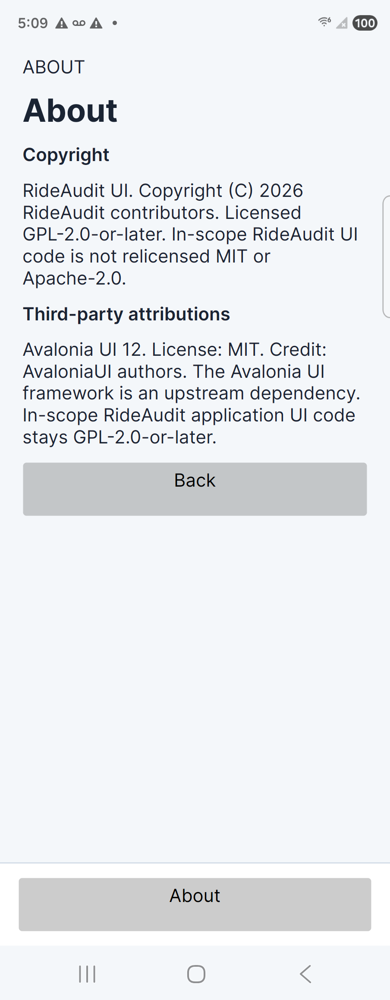
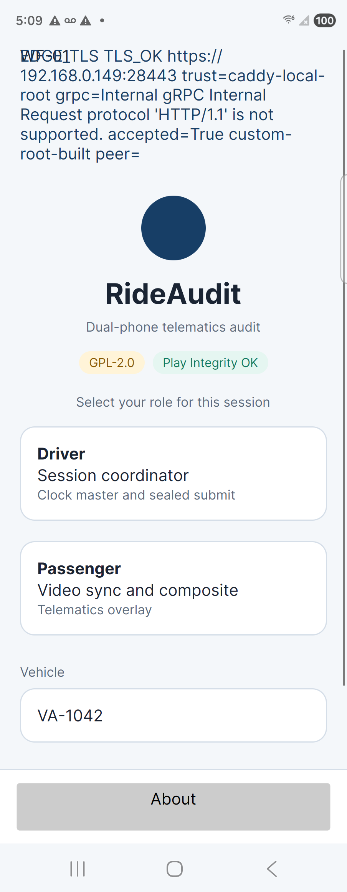

# About view holds the copyright

TimestampUtc: 2026-09-29T22:18:00Z

The shared Avalonia UI no longer puts the copyright notice on the top title bar. A bottom-panel About button opens an About view. That view shows the RideAudit UI copyright and the Avalonia MIT credit. This does not satisfy FR-RIDE-074, UC-RIDE-044, TR-RIDE-VIEW-007, or TEST-RIDE-055. Those rows stay Draft. `isSatisfied` stays false. This is not a visual agreement, a Caddy closure, an OTS result, a hardware HSM result, or a Play publication.

## What changed

- `MainView` dropped `LicenseNotice` and `FrameworkNotice`. The hidden title line is the wordmark only.
- The bottom panel is an About button named `AboutButton`. It replaces the capture-shell footer text `About / source    Privacy notice`.
- `AboutView` screen id `ABOUT` shows `UiLicense.Notice` on `CopyrightText` and `UiLicense.Attributions` on `AttributionText`. Both wrap. Text trimming is None.
- Attributions name Avalonia UI 12, the MIT license, and the AvaloniaUI authors. That text comes from `NOTICE`. It is not a public-trust claim.
- WF-01 and WF-R-01 baselines now label the bottom entry About. aiUnit does not have a separate About wireframe id, so the full device visual suite was not re-run. Pixel agreement stays unclaimed.
- `UsabilityInspector` adds `about-cutoff`. Frames without `CopyrightText` or `AttributionText` record `not-run`. A wrapped copyright box that is shorter than the estimated line height fails.

## Headless checks

`TestRide035ShellTests`: Passed 12, Failed 0. The capture fact opens About from the bottom button, checks that the title bar has no Copyright string, and checks that the arranged copyright and attribution boxes are at least as tall as the estimated wrapped lines.

`UsabilityInspectorTests`, `VisualCatalogTests`, and `CodexSubscriptionProfileTests`: Passed 6, Failed 0. `About_copyright_cutoff_fails_when_the_box_is_too_short` fails a 16px-tall copyright box and passes a 96px box. The catalog still lists 16 wireframes and 12 storyboards.

## Fold 4

- Serial: `RFCW7078MVZ`
- Model: `SM_F936U`
- Transport: USB adb
- Package: `org.rideaudit.app` debug APK, incremental install Success in 6014 ms
- Role screen dump: one node `text="About"`, bounds `[42,2032][862,2158]`. The dump does not contain `Copyright` or `About / source`.
- Tap at 452,2095 opened About.
- About dump: `ABOUT`, heading About, then `RideAudit UI. Copyright (C) 2026 RideAudit contributors. Licensed GPL-2.0-or-later. In-scope RideAudit UI code is not relicensed MIT or Apache-2.0.`
- Attribution dump: `Avalonia UI 12. License: MIT. Credit: AvaloniaUI authors. The Avalonia UI framework is an upstream dependency. In-scope RideAudit application UI code stays GPL-2.0-or-later.`
- Copyright bounds `[52,415][852,670]` (800 by 255). Attribution bounds `[52,783][852,1038]` (800 by 255). Both sit above the bottom About button. The boxes are taller than one line.
- This capture did not attach AvaloniaRemote, so the device frame was not scored by `about-cutoff`. The bounds above are the phone evidence. The fail-closed cutoff case is the unit test.

About screenshot SHA256 `A93AAC8F22275B13089BB27B79B718AD7CB170FE6A9F56BED2B37E18D8B8D270` (176357 bytes, PNG magic `89 50 4E 47`). Role screenshot SHA256 `86B6741F3AD90BED3971A1741194ED46674DD811354A07560BE57E53F6B62894` (204935 bytes). About UI dump SHA256 `AE0A478CC0D20C014626A9932C96377ACE64816B066B15BA21FFA381C48DFD12`.

The Motorola edge 2024 was not part of this capture. Wireless adb was not connected. This receipt does not claim an Edge result.

## Not closed

Visual agreement, usability agreement, AC-UC-025-001, plan section 9, Caddy, OTS, hardware HSM, and Play publication stay open. The debug APK still carries the earlier lab TLS probe. Health did not become ok because of this UI change.
