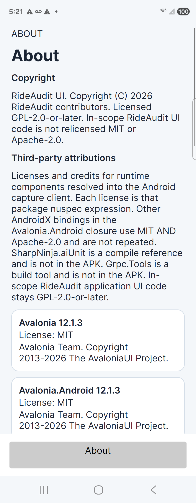
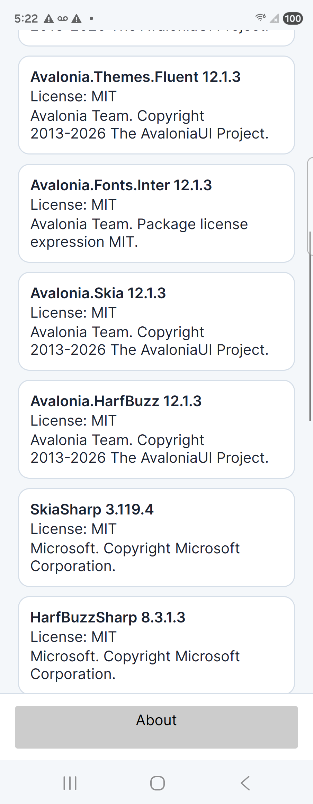
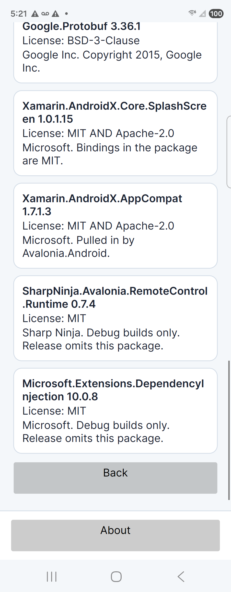

# About lists third-party attributions

TimestampUtc: 2026-09-29T22:28:51Z

The About view keeps the RideAudit copyright and the bottom-panel About button. Under that copyright it now lists licenses and credits for runtime components resolved into the Android capture client. The list sits in a scroll viewer, with each row wrapping. This does not satisfy FR-RIDE-074, UC-RIDE-044, TR-RIDE-VIEW-007, or TEST-RIDE-055. `isSatisfied` stays false.

## List

Each license is the package nuspec expression. Credits name the nuspec authors.

- Avalonia, Avalonia.Android, Avalonia.Themes.Fluent, Avalonia.Fonts.Inter, Avalonia.Skia, Avalonia.HarfBuzz 12.1.3, MIT, Avalonia Team.
- SkiaSharp 3.119.4, MIT, Microsoft.
- HarfBuzzSharp 8.3.1.3, MIT, Microsoft.
- Grpc.Net.Client and Grpc.Core.Api 2.84.0, Apache-2.0, The gRPC Authors.
- Google.Protobuf 3.36.1, BSD-3-Clause, Google Inc.
- Xamarin.AndroidX.Core.SplashScreen 1.0.1.15 and Xamarin.AndroidX.AppCompat 1.7.1.3, MIT AND Apache-2.0, Microsoft.
- SharpNinja.Avalonia.RemoteControl.Runtime 0.7.4 and Microsoft.Extensions.DependencyInjection 10.0.8, MIT. The row says Debug builds only. Release omits those packages.

Other AndroidX bindings in the Avalonia.Android closure use MIT AND Apache-2.0 and are not repeated. SharpNinja.aiUnit is a compile reference and is not in the APK. Grpc.Tools is a build tool and is not in the APK. Avalonia.Fonts.Inter is recorded as the package license MIT. This receipt does not add a separate font license that was not in that nuspec.

aiUnit still has no About wireframe id. The catalog stays at 16 wireframes. Those baselines were not changed for this list. Pixel agreement stays unclaimed.

## Checks

`TestRide035ShellTests`: Passed 12, Failed 0. The About fact requires MIT, Apache-2.0, BSD-3-Clause, The gRPC Authors, Google Inc., SkiaSharp 3.119.4, and the debug-only line. Each attribution text wraps, and the About scroll extent is taller than the viewport.

`UsabilityInspectorTests`: Passed 4, Failed 0. `about-cutoff` still fails a copyright box that is too short, and it now includes text blocks whose names start with Attribution.

## Fold 4

- Serial: `RFCW7078MVZ`
- Model: `SM_F936U`
- Transport: USB adb
- Package: `org.rideaudit.app` debug APK, incremental install Success
- Top of About shows the copyright and the start of the list, including the note that aiUnit is not in the APK.
- One swipe shows Avalonia.Skia, SkiaSharp 3.119.4, HarfBuzzSharp 8.3.1.3, and Grpc.Net.Client.
- Further scrolling reaches Google.Protobuf 3.36.1, BSD-3-Clause, both AndroidX rows, both debug-only rows, and Back. The last credit box ends above Back. Those rows are not clipped to a single line.

Top screenshot SHA256 `D0B9281062526B46023F35C702C0C97B2B6ECAAEC7C9CE89DF98DB3AC02EDEDB` (333633 bytes). Mid screenshot SHA256 `087C5FACA7EB876D48F953DD4B168141E357F2727BE2557A19E1C27C95B32680` (261808 bytes). End screenshot SHA256 `FEBC2222CEE8C5252A553B5FCB085DCB42B2CC401B40E9CE4CBF472C4CA94331` (265937 bytes). PNG magic `89 50 4E 47`.

The Motorola edge 2024 was not part of this capture.

## Not closed

Visual agreement, usability agreement, AC-UC-025-001, plan section 9, Caddy, OTS, hardware HSM, and Play publication stay open.
