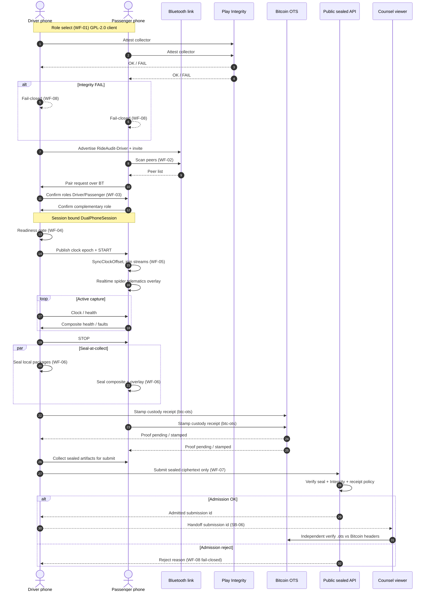

# Mermaid session flow (dual-phone RideAudit)

**Artifact:** ART-RIDE-UX-001  
**Related:** SB-01 .. SB-06, WF-01 .. WF-08  
**Chain default:** Bitcoin OpenTimestamps (`btc-ots`)

Sequence for one DualPhoneSession: Bluetooth pairing, driver coordination, passenger composite with telematics overlay, seal-at-collect, public sealed submit admission, and counsel viewer handoff.

## Notes

- Driver coordinates; passenger composites. Not a Lyft Bluetooth API.
- Seal-at-collect happens before upload. No decrypt at ingest.
- Primary custody receipt path is Bitcoin OpenTimestamps. Optional L2 fast-confirm only when dual-anchor config is enabled (`docs/architecture/blockchain-custody-receipts.md`).
