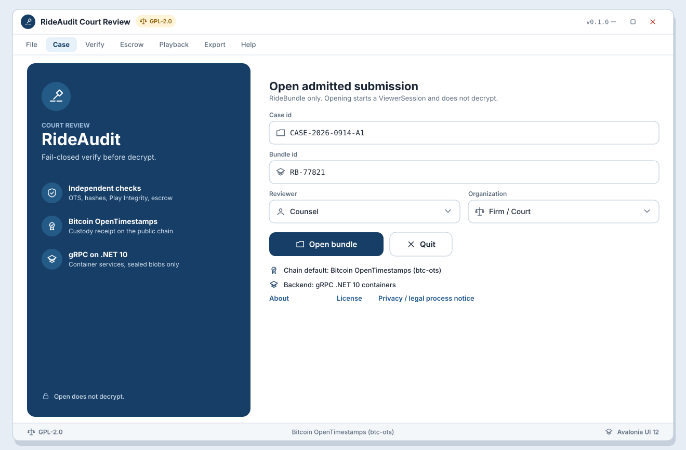

# SB-R-01 Open bundle

**Artifact:** ART-RIDE-UX-REVIEW-001  
**FR links:** FR-RIDE-049, FR-RIDE-052, FR-RIDE-038  
**Screens:** [WF-R-01](../../assets/wireframes/WF-R-01-splash-case-open.svg), [WF-R-02](../../assets/wireframes/WF-R-02-bundle-contents.svg)
**UI:** Avalonia UI 12 desktop

<!-- wireframe-svg:start -->

## Visual wireframes

SVG mocks for the screens in this storyboard. Icons are inline SVG paths.

[Open WF-R-01-splash-case-open.svg](../../assets/wireframes/WF-R-01-splash-case-open.svg)

[Open WF-R-02-bundle-contents.svg](../../assets/wireframes/WF-R-02-bundle-contents.svg)

<!-- wireframe-svg:end -->

## Goal

Counsel opens an admitted submission or `RideBundle`, starts a `ViewerSession`, and sees sealed package metadata (roles, vehicle, hashes/receipt ids) without decrypting.

## Actors

- Counsel / Auditor
- Avalonia UI 12 review app
- gRPC .NET 10 admission/index service (containers)

## Beats

1. **Splash / case open (WF-R-01)**  
   Reviewer launches the GPL-2.0 Avalonia desktop viewer, selects case id or pastes admitted submission / RideBundle id, and confirms reviewer role.

2. **ViewerSession start**  
   App records build/version, role, case/bundle id, and start time. No escrow key material is loaded yet.

3. **Sealed contents (WF-R-02)**  
   Bundle list shows driver coordinator / passenger compositor packages, vehicle binding, sealed flags, content hash ids, and OTS receipt ids. Decrypt and play remain disabled.

## Success criteria

- Only admitted sealed bundles open successfully.
- Sealed list is visible with dual-phone roles; no plaintext evidence shown.
- ViewerSession exists before verification proceeds.

## Notes

Handoff from mobile submit success (SB-06 overview) lands here for detailed desktop review.
