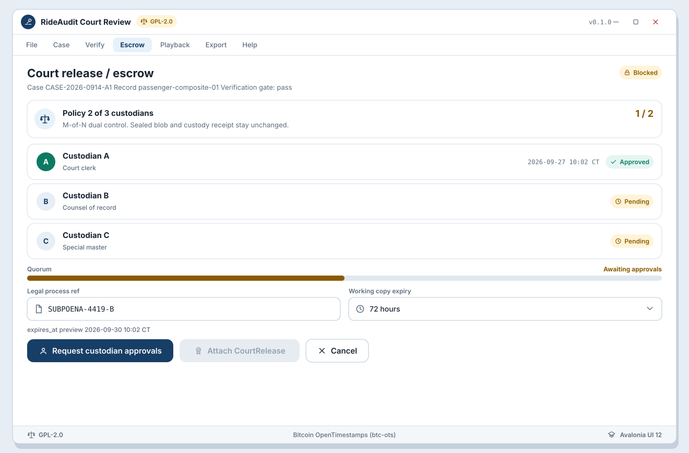

# SB-R-03 Escrow release

**Artifact:** ART-RIDE-UX-REVIEW-001  
**FR links:** FR-RIDE-020, FR-RIDE-022, FR-RIDE-028, FR-RIDE-049  
**Screens:** [WF-R-05](../../assets/wireframes/WF-R-05-escrow-release-quorum.svg)
**UI:** Avalonia UI 12 desktop

<!-- wireframe-svg:start -->

## Visual wireframes

SVG mocks for the screens in this storyboard. Icons are inline SVG paths.

[Open WF-R-05-escrow-release-quorum.svg](../../assets/wireframes/WF-R-05-escrow-release-quorum.svg)

<!-- wireframe-svg:end -->

## Goal

Attach a court-authorized `CourtRelease` under M-of-N dual-control escrow, then allow decrypt only into an expiring authorized working copy. Never casual plaintext.

## Actors

- Counsel (authorized requester)
- Escrow custodians (quorum)
- Avalonia review app
- gRPC escrow service (.NET 10 containers)

## Beats

1. **Request release**  
   After verification pass, counsel initiates CourtRelease for the case/bundle. UI shows legal-process reference fields and required quorum M-of-N (WF-R-05).

2. **Dual-control attestations**  
   Custodians approve until quorum is met. Below-quorum state cannot decrypt.

3. **Attach CourtRelease**  
   App stores authorizer, case_id, dual-control attestations, `decrypted_working_copy_ref`, and `expires_at`. Escrow release log is append-only; sealed blob and receipt stay unchanged.

4. **Decrypt to working copy**  
   Only after quorum: unwrap DEK / use released key material to create expiring working copy. Playback remains gated on non-expiry.

## Success criteria

- Decrypt path is exclusively escrow/court-authorized (FR-RIDE-049).
- M-of-N dual control is visible and enforced (FR-RIDE-022).
- Working copy expiry is explicit and enforced.

## Notes

Viewer must not offer an offline "developer decrypt" or bypass control.
