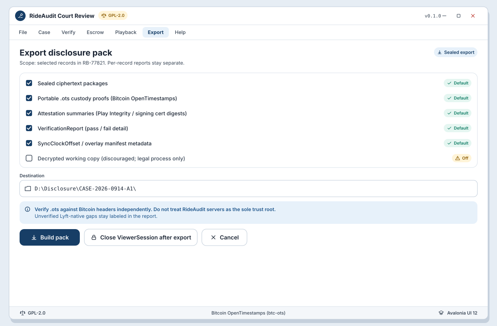

# SB-R-06 Export disclosure

**Artifact:** ART-RIDE-UX-REVIEW-001  
**FR links:** FR-RIDE-017, FR-RIDE-018, FR-RIDE-028, FR-RIDE-052  
**Screens:** [WF-R-07](../../assets/wireframes/WF-R-07-provenance-custody-ots.svg), [WF-R-08](../../assets/wireframes/WF-R-08-export-opposing-counsel.svg)
**UI:** Avalonia UI 12 desktop  
**Chain default:** Bitcoin OpenTimestamps (`btc-ots`)

<!-- wireframe-svg:start -->

## Visual wireframes

SVG mocks for the screens in this storyboard. Icons are inline SVG paths.

[Open WF-R-07-provenance-custody-ots.svg](../../assets/wireframes/WF-R-07-provenance-custody-ots.svg)

[Open WF-R-08-export-opposing-counsel.svg](../../assets/wireframes/WF-R-08-export-opposing-counsel.svg)

<!-- wireframe-svg:end -->

## Goal

Export a disclosure pack (sealed packages + portable `.ots` + attestation summary + `VerificationReport`) for opposing counsel independent verification, then close the `ViewerSession` with an audit log.

## Actors

- Counsel
- Opposing counsel / independent verifier (export consumer)
- Avalonia review app

## Beats

1. **Assemble pack (WF-R-08)**  
   Select records in scope. Pack includes sealed ciphertext, `.ots` files, attestation summaries, and VerificationReport(s). Working-copy plaintext is not the disclosure default.

2. **Explain independent OTS path (WF-R-07)**  
   Provenance panel / export readme points to verifying `.ots` against Bitcoin headers without trusting RideAudit servers alone.

3. **Export complete**  
   Write pack to counsel-chosen location. Log export event on ViewerSession.

4. **Close session**  
   End ViewerSession, append access/render events, enforce working-copy expiry/purge.

## Success criteria

- Disclosure supports independent OTS and hash checks (FR-RIDE-028).
- Per-record reports included for multi-driver bundles.
- Session close is auditable (FR-RIDE-052).

## Notes

Exporting sealed + proofs is preferred over exporting plaintext working copies. If a jurisdiction requires working-copy disclosure, expiry and legal-process fields remain attached.
