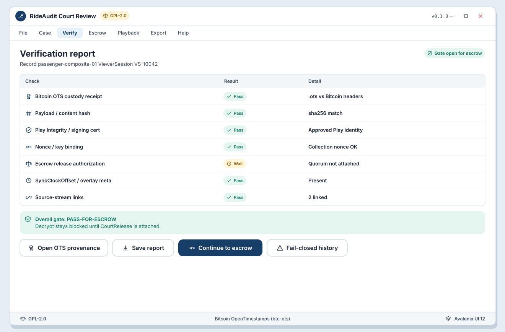

# WF-R-03 Verification report panel

**Platform:** Desktop (Avalonia UI 12)  
**Storyboards:** SB-R-02, SB-R-05  
**Artifact:** ART-RIDE-UX-REVIEW-001  
**Chain default:** Bitcoin OpenTimestamps (btc-ots)

<!-- wireframe-svg:start -->

## Visual wireframe

Realistic SVG mock with inline icon paths. The ASCII block below stays the structural spec.



[Open WF-R-03-verification-report.svg](../../assets/wireframes/WF-R-03-verification-report.svg)

<!-- wireframe-svg:end -->


```
+----------------------------------------------------------------------+
| VerificationReport  record: passenger-composite-01                   |
| ViewerSession: VS-10042                                              |
+----------------------------------------------------------------------+
| Check                              Result     Detail                 |
| -------------------------------------------------------------------  |
| Bitcoin OTS custody receipt        PASS       .ots vs BTC headers    |
| Payload / content hash             PASS       sha256 match           |
| Play Integrity / signing cert      PASS       approved Play identity |
| Nonce / key binding                PASS       collection nonce OK    |
| Escrow release authorization       WAIT       quorum not attached    |
| SyncClockOffset / overlay meta     PASS       present                |
| Source-stream links                PASS       2 linked               |
+----------------------------------------------------------------------+
| Overall gate: PASS-FOR-ESCROW (decrypt still blocked until CourtRelease)
|                                                                      |
| [ Open OTS provenance ]  [ Save report ]  [ Continue to escrow ]      |
| [ Fail-closed history ]                                              |
+----------------------------------------------------------------------+
```

## Behavior

- Independent checks run before decrypt/display (FR-RIDE-050).
- Bitcoin OTS is primary custody receipt verification.
- Escrow WAIT is not a soft decrypt; Continue only opens WF-R-05.
- Any FAIL routes to WF-R-04.
