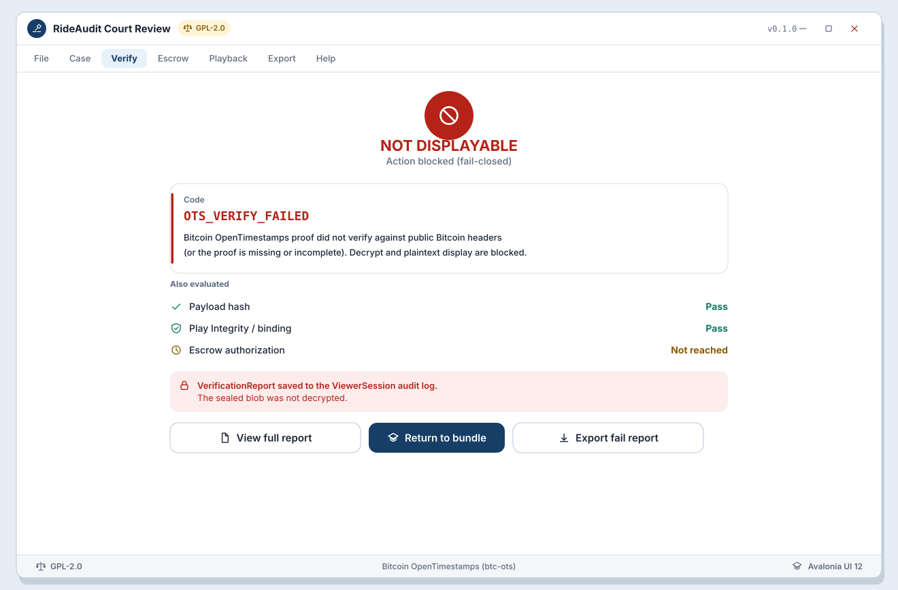

# WF-R-04 Fail-closed blocking screen

**Platform:** Desktop (Avalonia UI 12)  
**Storyboards:** SB-R-02, SB-R-05  
**Artifact:** ART-RIDE-UX-REVIEW-001  
**Chain default:** Bitcoin OpenTimestamps (btc-ots)

<!-- wireframe-svg:start -->

## Visual wireframe

Realistic SVG mock with inline icon paths. The ASCII block below stays the structural spec.



[Open WF-R-04-fail-closed-blocking.svg](../../assets/wireframes/WF-R-04-fail-closed-blocking.svg)

<!-- wireframe-svg:end -->


```
+----------------------------------------------------------------------+
| ACTION BLOCKED (fail-closed)                                         |
+----------------------------------------------------------------------+
|                                                                      |
|                    !!  NOT DISPLAYABLE                               |
|                                                                      |
|  +----------------------------------------------------------------+  |
|  | Code: OTS_VERIFY_FAILED                                        |  |
|  | Bitcoin OpenTimestamps proof did not verify against            |  |
|  | public Bitcoin headers (or proof missing/incomplete).          |  |
|  | Decrypt and plaintext display are blocked.                     |  |
|  +----------------------------------------------------------------+  |
|                                                                      |
|  Also evaluated                                                      |
|  - Payload hash: PASS                                                |
|  - Play Integrity / binding: PASS                                    |
|  - Escrow authorization: NOT REACHED                                 |
|                                                                      |
|  VerificationReport saved to ViewerSession audit log.                |
|  Sealed blob was NOT decrypted.                                      |
|                                                                      |
|  [ View full VerificationReport ]   [ Return to bundle ]             |
|  [ Export fail report for counsel ]                                  |
+----------------------------------------------------------------------+
```

## Common reason codes (illustrative)

| Code | When |
| --- | --- |
| OTS_VERIFY_FAILED | Bitcoin OTS proof missing, incomplete, or fails header verify |
| HASH_MISMATCH | Payload / content hash mismatch |
| PI_ATTESTATION_FAILED | Play Integrity / signing cert or binding failed |
| ESCROW_AUTH_MISSING | CourtRelease / quorum not satisfied |
| ESCROW_QUORUM_FAILED | M-of-N below policy |
| WORKING_COPY_EXPIRED | Authorized working copy past expires_at |
| BUNDLE_RECORD_FAIL | Multi-driver record failed its own gate |

## Behavior

- No silent continue into decrypt or playback (NFR-22).
- Multi-driver: failure is per-record; UI must not claim merged custody OK.
