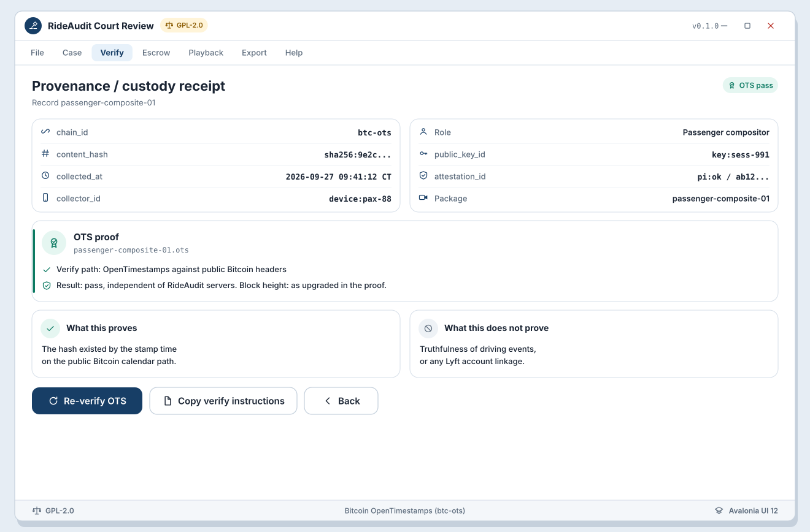

# WF-R-07 Provenance / custody receipt (OTS)

**Platform:** Desktop (Avalonia UI 12)  
**Storyboards:** SB-R-02, SB-R-06  
**Artifact:** ART-RIDE-UX-REVIEW-001  
**Chain default:** Bitcoin OpenTimestamps (btc-ots)

<!-- wireframe-svg:start -->

## Visual wireframe

Realistic SVG mock with inline icon paths. The ASCII block below stays the structural spec.



[Open WF-R-07-provenance-custody-ots.svg](../../assets/wireframes/WF-R-07-provenance-custody-ots.svg)

<!-- wireframe-svg:end -->


```
+----------------------------------------------------------------------+
| Provenance / CustodyReceipt                                          |
| Record: passenger-composite-01                                       |
+----------------------------------------------------------------------+
| chain_id:        btc-ots                                             |
| content_hash:    sha256:9e2c...                                      |
| collected_at:    2026-09-27 09:41:12 CT                              |
| collector_id:    device:pax-88 / role:Passenger compositor           |
| public_key_id:   key:sess-991                                        |
| attestation_id:  pi:ok / cert digest: ab12...                        |
|                                                                      |
| OTS proof                                                            |
|  portable file:  passenger-composite-01.ots                          |
|  verify path:    OpenTimestamps vs public Bitcoin headers            |
|  result:         PASS (independent; does not trust RideAudit alone)  |
|  block height:   (as upgraded in proof)                              |
|                                                                      |
| Optional L2 dual-anchor: not enabled for this receipt                |
|                                                                      |
| What this proves / does not prove                                    |
|  Proves: hash existed by stamp time on public Bitcoin calendar path  |
|  Does not prove: truthfulness of driving events or Lyft accounts     |
|                                                                      |
| [ Re-verify OTS ]  [ Copy verify instructions ]  [ Back ]            |
+----------------------------------------------------------------------+
```

## Behavior

- Surfaces Bitcoin OTS as primary custody receipt path.
- Explains independent verify without RideAudit server trust.
- Linked from VerificationReport (WF-R-03) and export (WF-R-08).
