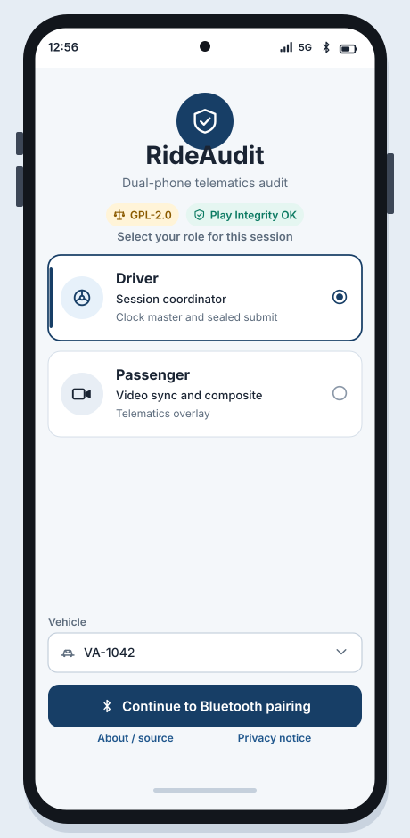
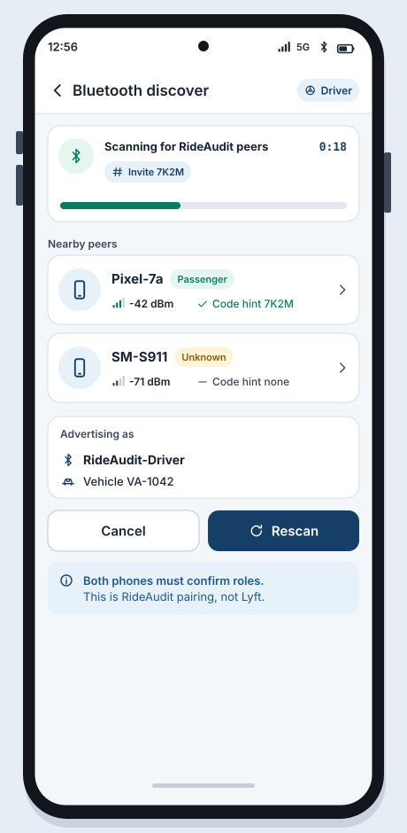
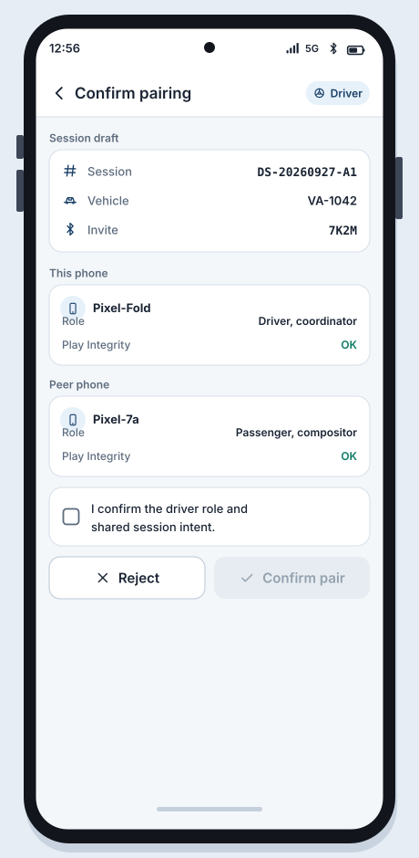

# SB-01 Pairing

**Artifact:** ART-RIDE-UX-001  
**FR links:** FR-RIDE-053, FR-RIDE-054  
**Screens:** [WF-01](../assets/wireframes/WF-01-splash-role-select.svg), [WF-02](../assets/wireframes/WF-02-bt-discover.svg), [WF-03](../assets/wireframes/WF-03-pairing-confirm.svg), [WF-08](../assets/wireframes/WF-08-fail-closed-errors.svg)

<!-- wireframe-svg:start -->

## Visual wireframes

SVG mocks for the screens in this storyboard. Icons are inline SVG paths.

[Open WF-01-splash-role-select.svg](../assets/wireframes/WF-01-splash-role-select.svg)

[Open WF-02-bt-discover.svg](../assets/wireframes/WF-02-bt-discover.svg)

[Open WF-03-pairing-confirm.svg](../assets/wireframes/WF-03-pairing-confirm.svg)

[Open WF-08-fail-closed-errors.svg](../assets/wireframes/WF-08-fail-closed-errors.svg)

<!-- wireframe-svg:end -->

## Goal

Two approved phones discover each other over Bluetooth and establish an authenticated driver-rider pairing for one authorized vehicle/session before dual capture begins.

## Actors

- Driver (session coordinator phone)
- Passenger / rider-side capture phone
- RideAudit Android client (GPL-2.0)

## Beats

1. **Splash / role select (both phones)**  
   Each user opens RideAudit, sees GPL-2.0 notice and Play Integrity status chip, then selects **Driver** or **Passenger**. Role is sticky for the session and shown on every subsequent screen.

2. **Bluetooth discover**  
   Driver phone advertises `RideAudit-Driver` with vehicle/session invite code. Passenger phone scans for nearby RideAudit peers. List shows device nickname, RSSI, and invite code match hint. Fail-closed if Bluetooth is off, permission denied, or no peers within timeout (WF-08).

3. **Pairing confirm**  
   Both phones show the peer identity, proposed roles (Driver coordinator / Passenger compositor), shared session id draft, and vehicle binding. Each side must explicitly confirm. Mismatched roles or invite codes abort with fail-closed error.

4. **Paired ready**  
   Secure session binding completes. Driver phone advances to dashboard (SB-02). Passenger phone waits for coordinator clock and start (SB-03).

## Success criteria

- Pairing completes only when both sides confirm role and shared session intent.
- Pairing fails closed on discovery, role, or binding failure.
- No Lyft Bluetooth or private APIs involved.

## Notes

RideAudit device pairing only. See `docs/architecture/dual-phone-bluetooth-roles.md`.
