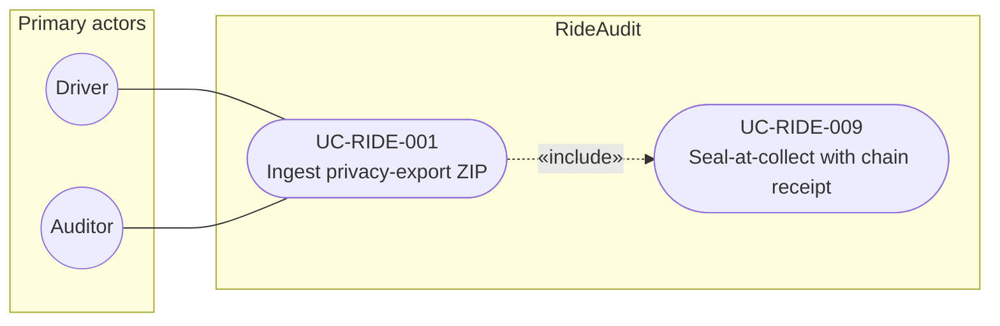

# UC-RIDE-001: Ingest privacy-export ZIP

**Author:** Sharp Ninja
**License:** GPL-2.0
**Source:** `docs/Project/Use-Cases-Batch.yaml`
**Actors field:** Driver, Auditor
**Realizes:** FR-RIDE-001, FR-RIDE-003, FR-RIDE-006, FR-RIDE-013

**Goal:** Driver or auditor uploads a consented Lyft privacy-export ZIP; system parses DataDictionary files and tags unknowns Unverified.

UML use case diagram. Notation is defined in [README.md](README.md). Session sequence diagrams under `docs/ux/flows/` are not a substitute for this diagram.

- Primary actors: Driver, Auditor
- Secondary actors: None.

## Relationships

- «include» UC-RIDE-009: basic flow step 3 seals the raw ZIP at the collection boundary and creates a custody receipt.

## Constraints

- The actor uploads a consented privacy-export ZIP. This use case does not call a Lyft private API.

## Unverified gaps

Unknown DataDictionary types are tagged Unverified. Whether a Lyft privacy export contains raw telematics or Smooth Cruiser event logs is Unverified in the source requirements.

## Related

- Included seal behavior: [UC-RIDE-009](UC-RIDE-009.md).
