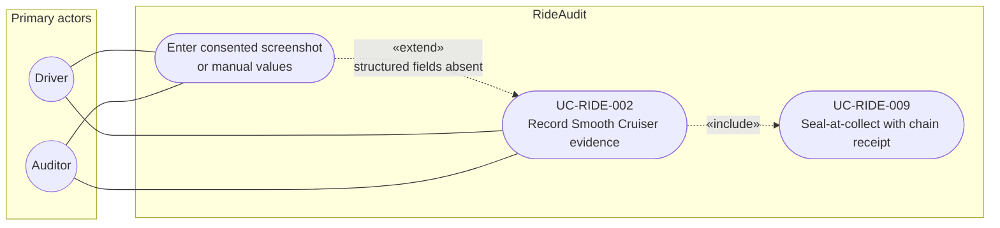

# UC-RIDE-002: Record Smooth Cruiser evidence

**Author:** Sharp Ninja
**License:** GPL-2.0
**Source:** `docs/Project/Use-Cases-Batch.yaml`
**Actors field:** Driver, Auditor
**Realizes:** FR-RIDE-002, FR-RIDE-006

**Goal:** Capture Smooth Cruiser scores from export fields or consented manual/screenshot entry with provenance.

UML use case diagram. Notation is defined in [README.md](README.md). Session sequence diagrams under `docs/ux/flows/` are not a substitute for this diagram.

- Primary actors: Driver, Auditor
- Secondary actors: None.

## Relationships

- «include» UC-RIDE-009: basic flow step 4 seals and receipts the capture.
- «extend» manual or screenshot entry: basic flow step 3 applies only when structured Smooth Cruiser fields are absent. The actor supplies timestamp and source tag.

## Constraints

- Manual and screenshot values stay source-tagged. They are not relabeled as a Lyft API response.

## Unverified gaps

Presence of structured Smooth Cruiser fields in a privacy export is Unverified. The manual path exists so the audit can record consented values without inventing an export schema.

## Related

- Seal: [UC-RIDE-009](UC-RIDE-009.md).
