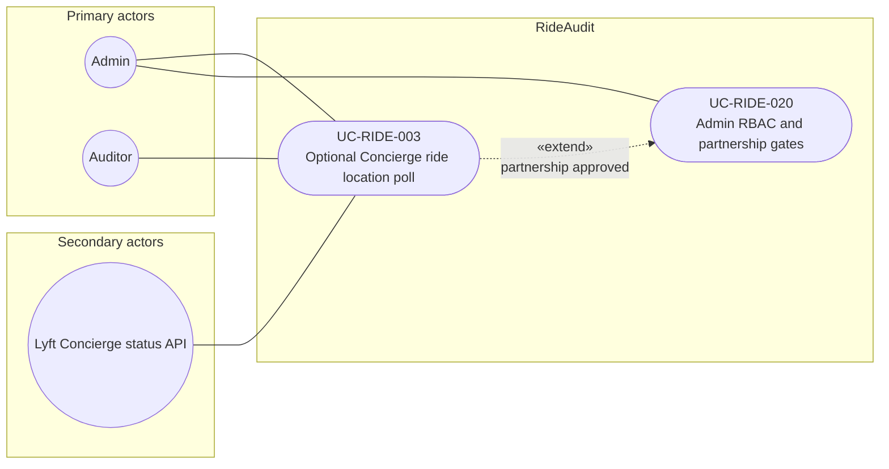

# UC-RIDE-003: Optional Concierge ride location poll

**Author:** Sharp Ninja
**License:** GPL-2.0
**Source:** `docs/Project/Use-Cases-Batch.yaml`
**Actors field:** Admin, Auditor
**Realizes:** FR-RIDE-004, FR-RIDE-011, FR-RIDE-012, FR-RIDE-204, FR-RIDE-206

**Goal:** Admin-enabled org polls Concierge status for driver_location on active org-booked rides only.

UML use case diagram. Notation is defined in [README.md](README.md). Session sequence diagrams under `docs/ux/flows/` are not a substitute for this diagram.

- Primary actors: Admin, Auditor
- Secondary actors: Lyft Concierge status API (ConciergeApi)

## Relationships

- «extend» UC-RIDE-020: the poll is optional behavior on the admin partnership gate. Basic flow steps 1 through 4 run when the admin marks the Business partnership approved.
- If the partnership is denied, Concierge features stay disabled and this extension does not run (basic flow step 5).

## Constraints

- The poll uses the documented Concierge status endpoint for active org-booked rides only. Stored points are coarse lat/lng with lyft_concierge_api provenance and are never labeled Smooth Cruiser.
- OAuth client credentials in basic flow step 2 are the documented Business program credentials for that status poll, not a private telematics API.

## Unverified gaps

Fields beyond the documented Concierge status payload (driver_location lat/lng, eta, status) are Unverified and are out of this use case. There is no public driver telematics API.

## Related

- Gate: [UC-RIDE-020](UC-RIDE-020.md).
