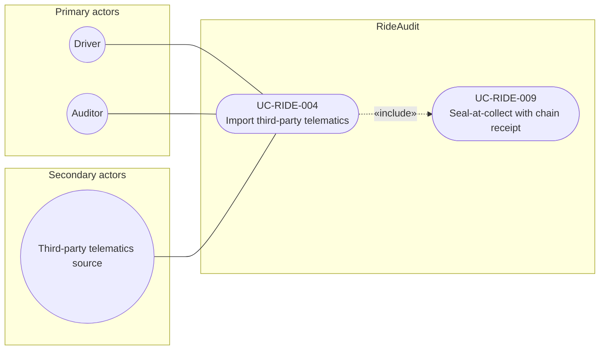

# UC-RIDE-004: Import third-party telematics

**Author:** Sharp Ninja
**License:** GPL-2.0
**Source:** `docs/Project/Use-Cases-Batch.yaml`
**Actors field:** Driver, Auditor
**Realizes:** FR-RIDE-005, FR-RIDE-006

**Goal:** Import CSV/JSON telematics from driver-controlled devices as parallel evidence.

UML use case diagram. Notation is defined in [README.md](README.md). Session sequence diagrams under `docs/ux/flows/` are not a substitute for this diagram.

- Primary actors: Driver, Auditor
- Secondary actors: Third-party telematics source (ThirdParty)

## Relationships

- «include» UC-RIDE-009: basic flow step 3 seals the package and writes a custody receipt.

## Constraints

- Imports are tagged third_party_telematics and are not claimed as Lyft-native origin (basic flow step 4).

## Unverified gaps

A partner mileage-app sync API for auditors is Unverified. This use case takes a driver-controlled CSV or JSON upload, not an invented Lyft or partner private API.

## Related

- Seal: [UC-RIDE-009](UC-RIDE-009.md).
