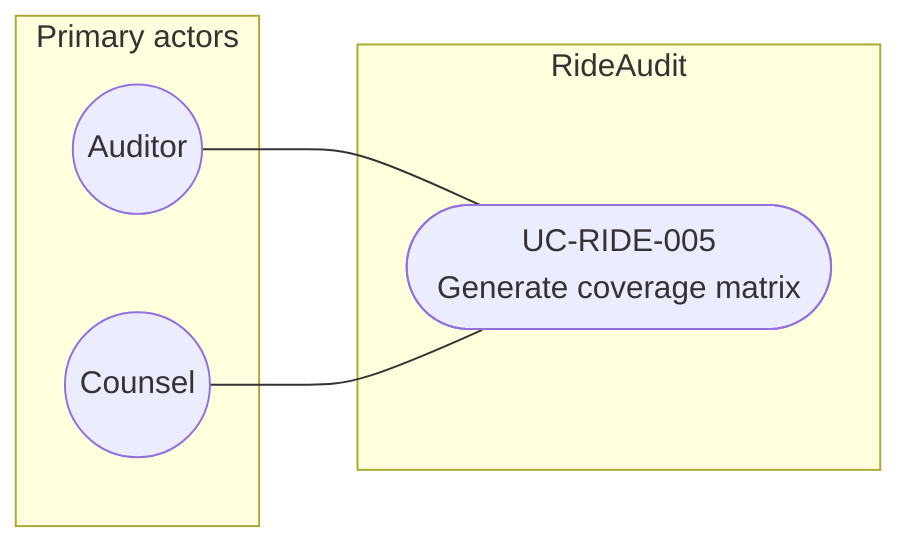

# UC-RIDE-005: Generate coverage matrix

**Author:** Sharp Ninja
**License:** GPL-2.0
**Source:** `docs/Project/Use-Cases-Batch.yaml`
**Actors field:** Auditor, Counsel
**Realizes:** FR-RIDE-007, FR-RIDE-209

**Goal:** Produce collected vs available vs missing signal matrix including API gaps.

UML use case diagram. Notation is defined in [README.md](README.md). Session sequence diagrams under `docs/ux/flows/` are not a substitute for this diagram.

- Primary actors: Auditor, Counsel
- Secondary actors: None.

## Relationships

- No «include» or «extend». The basic flow is one use case: open the subject coverage view, list Lyft-collected categories against audit-available data, and mark missing signals with the API-gap notice.

## Constraints

- The API-gap notice is part of this use case. It does not add undocumented Lyft endpoints to fill gaps.

## Unverified gaps

Which signal categories a privacy export or Concierge status poll actually contains remains Unverified where the source requirements say so. The matrix shows those gaps instead of inferring the missing signals.

## Related

- Incident packaging of available signals: [UC-RIDE-007](UC-RIDE-007.md).
