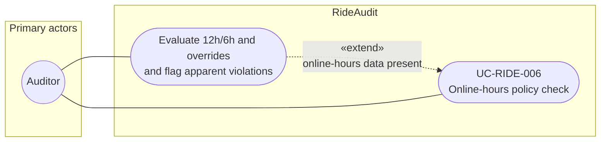

# UC-RIDE-006: Online-hours policy check

**Author:** Sharp Ninja
**License:** GPL-2.0
**Source:** `docs/Project/Use-Cases-Batch.yaml`
**Actors field:** Auditor
**Realizes:** FR-RIDE-008

**Goal:** Analyze online hours against 12h/6h and regional overrides when data present.

UML use case diagram. Notation is defined in [README.md](README.md). Session sequence diagrams under `docs/ux/flows/` are not a substitute for this diagram.

- Primary actors: Auditor
- Secondary actors: None.

## Relationships

- «extend» evaluation and flags: basic flow steps 3 and 4 run only when online-hours data exists. If the data is absent, the use case does not flag a violation.

## Constraints

- Apparent violations are flags against available hours data and the selected policy profile, not a claim that Lyft exposed an hours API.

## Unverified gaps

None specific to this use case beyond the project rule: do not invent Lyft private APIs, and keep source Unverified caveats visible where they apply.

## Related

- None.
