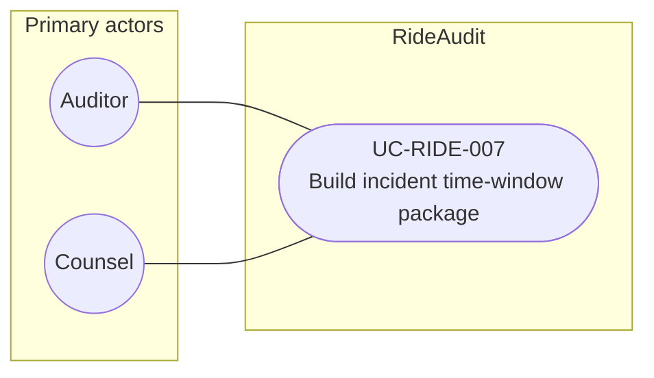

# UC-RIDE-007: Build incident time-window package

**Author:** Sharp Ninja
**License:** GPL-2.0
**Source:** `docs/Project/Use-Cases-Batch.yaml`
**Actors field:** Auditor, Counsel
**Realizes:** FR-RIDE-009, FR-RIDE-207

**Goal:** Export available GPS, scores, and third-party events for a counsel time window.

UML use case diagram. Notation is defined in [README.md](README.md). Session sequence diagrams under `docs/ux/flows/` are not a substitute for this diagram.

- Primary actors: Auditor, Counsel
- Secondary actors: None.

## Relationships

- No «include» or «extend». Basic flow steps 2 and 3 assemble sealed-record references and export the package with provenance and verification stubs. Stubs are not the counsel decrypt path.

## Constraints

- The package contains available sealed-record references. It does not invent missing Lyft signals for the interval.

## Unverified gaps

None specific to this use case beyond the project rule: do not invent Lyft private APIs, and keep source Unverified caveats visible where they apply.

## Related

- Counsel verification of a sealed record is [UC-RIDE-010](UC-RIDE-010.md), which this package does not include.
- Coverage of what is available vs missing: [UC-RIDE-005](UC-RIDE-005.md).
