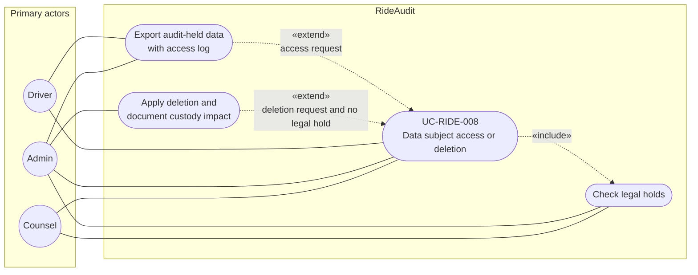

# UC-RIDE-008: Data subject access or deletion

**Author:** Sharp Ninja
**License:** GPL-2.0
**Source:** `docs/Project/Use-Cases-Batch.yaml`
**Actors field:** Driver, Admin, Counsel
**Realizes:** FR-RIDE-010, FR-RIDE-202, FR-RIDE-203, FR-RIDE-208, FR-RIDE-210

**Goal:** Honor DSAR access/deletion for audit-held data subject to legal holds.

UML use case diagram. Notation is defined in [README.md](README.md). Session sequence diagrams under `docs/ux/flows/` are not a substitute for this diagram.

- Primary actors: Driver, Admin, Counsel
- Secondary actors: None.

## Relationships

- «include» check legal holds: basic flow step 2 always runs before access or deletion.
- «extend» export: basic flow step 3 is the access path.
- «extend» deletion: basic flow step 4 applies only when there is no legal hold.

## Constraints

- The requester is the data subject or an authorized agent. Driver, Admin, and Counsel are the actors named on the use case.
- Deletion documents custody impact. It does not rewrite an already anchored custody receipt.

## Unverified gaps

None specific to this use case beyond the project rule: do not invent Lyft private APIs, and keep source Unverified caveats visible where they apply.

## Related

- Compliance confirmation of legal-hold controls, without performing this DSAR, is [UC-RIDE-021](UC-RIDE-021.md).
