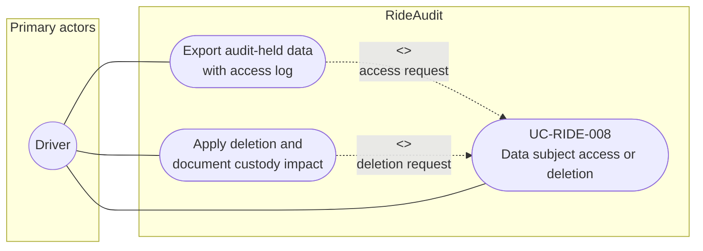

# UC-RIDE-008: Data subject access or deletion

**Author:** Sharp Ninja
**License:** GPL-2.0
**Source:** `docs/Project/Use-Cases-Batch.yaml`
**Actors field:** Driver
**Realizes:** FR-RIDE-010

**Goal:** Honor DSAR access and deletion for audit-held data.

UML use case diagram. Notation is defined in [README.md](README.md). Session sequence diagrams under `docs/ux/flows/` are not a substitute for this diagram.

- Primary actors: Driver
- Secondary actors: None.

## Relationships

- <<extend>> export: access path exports audit-held data with an access log.
- <<extend>> deletion: deletion path applies deletion and documents custody impact.

## Constraints

- The requester is the data subject (Driver) or an authorized agent acting for that driver.
- Deletion documents custody impact. It does not rewrite an already anchored custody receipt.

## Unverified gaps

None specific to this use case beyond the project rule: do not invent Lyft private APIs, and keep source Unverified caveats visible where they apply.

## Related

- Optional Concierge poll remains out of this DSAR use case.
