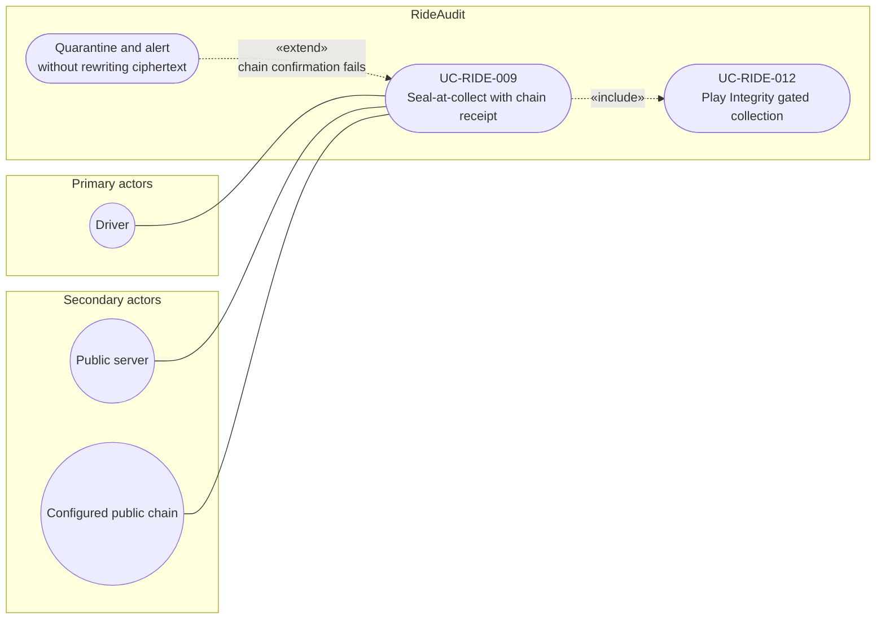

# UC-RIDE-009: Seal-at-collect with chain receipt

**Author:** Sharp Ninja
**License:** GPL-2.0
**Source:** `docs/Project/Use-Cases-Batch.yaml`
**Actors field:** Driver, PublicServer
**Realizes:** FR-RIDE-015, FR-RIDE-016, FR-RIDE-017, FR-RIDE-018, FR-RIDE-019, FR-RIDE-201, FR-RIDE-211, FR-RIDE-212, FR-RIDE-213

**Goal:** Collect datum, seal/encrypt immediately, write custody receipt to configured public chain, admit only on confirmation.

UML use case diagram. Notation is defined in [README.md](README.md). Session sequence diagrams under `docs/ux/flows/` are not a substitute for this diagram.

- Primary actors: Driver
- Secondary actors: Public server (PublicServer), Configured public chain (PublicChain)

## Relationships

- «include» UC-RIDE-012: basic flow step 1 starts collection on an approved app only after the Integrity check.
- «extend» quarantine: basic flow step 5, on chain-write failure, quarantines and alerts without rewriting ciphertext and does not admit the collection.
- Success path: scoped key, sealed payload, custody receipt, configured-chain write, then admit only after confirmation (basic flow steps 2 through 5).

## Constraints

- The configured public chain is the receipt anchor named in this use case. The architecture default anchor is Bitcoin OpenTimestamps (btc-ots), and the chain remains configurable.
- Public server participation here is admission of a confirmed collection, not decrypt-at-ingest.

## Unverified gaps

None specific to this use case beyond the project rule: do not invent Lyft private APIs, and keep source Unverified caveats visible where they apply.

## Related

- Integrity gate: [UC-RIDE-012](UC-RIDE-012.md).
- This seal is included by UC-RIDE-001, UC-RIDE-002, UC-RIDE-004, UC-RIDE-017, UC-RIDE-023, UC-RIDE-024, and UC-RIDE-028.
