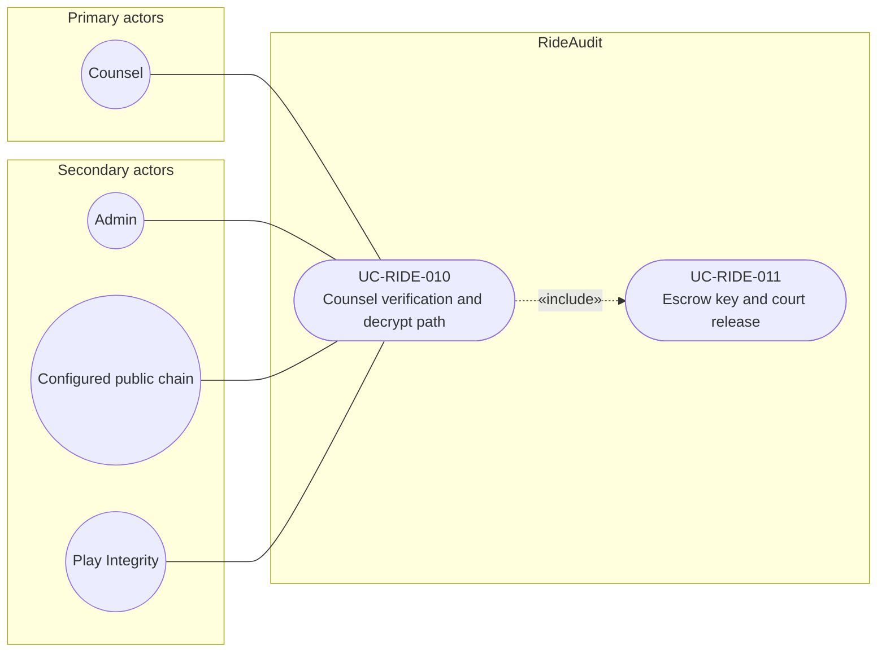

# UC-RIDE-010: Counsel verification and decrypt path

**Author:** Sharp Ninja
**License:** GPL-2.0
**Source:** `docs/Project/Use-Cases-Batch.yaml`
**Actors field:** Counsel, Admin
**Realizes:** FR-RIDE-020, FR-RIDE-021, FR-RIDE-028, FR-RIDE-214

**Goal:** Counsel verifies hash, chain, attestation, escrow logs, then obtains expiring working copy via documented path.

UML use case diagram. Notation is defined in [README.md](README.md). Session sequence diagrams under `docs/ux/flows/` are not a substitute for this diagram.

- Primary actors: Counsel
- Secondary actors: Admin, Configured public chain (PublicChain), Play Integrity

## Relationships

- «include» UC-RIDE-011: basic flow step 4 follows the documented legal-process and escrow release before the expiring working copy is issued.
- Hash recompute, on-chain receipt check, and Play attestation plus key binding (basic flow steps 2 and 3) are the behavior of this use case, with the configured public chain and Play Integrity as secondary actors.

## Constraints

- The working copy expires and access is logged (basic flow step 5). Verification does not mutate the sealed record.

## Unverified gaps

None specific to this use case beyond the project rule: do not invent Lyft private APIs, and keep source Unverified caveats visible where they apply.

## Related

- Escrow release: [UC-RIDE-011](UC-RIDE-011.md).
- Composite playback includes this path: [UC-RIDE-018](UC-RIDE-018.md).
