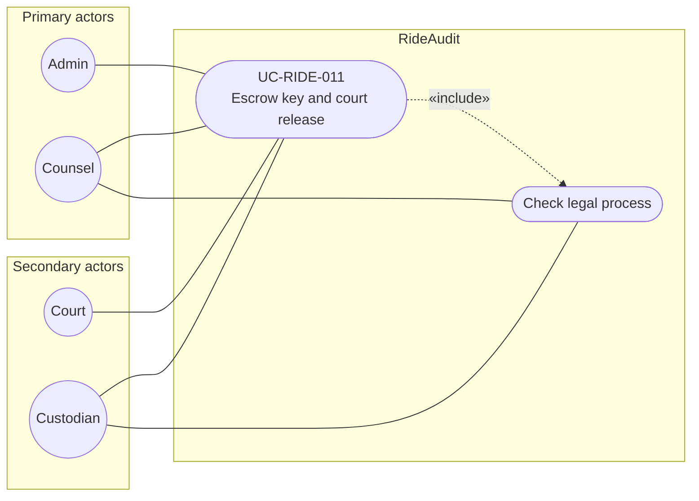

# UC-RIDE-011: Escrow key and court release

**Author:** Sharp Ninja
**License:** GPL-2.0
**Source:** `docs/Project/Use-Cases-Batch.yaml`
**Actors field:** Admin, Counsel
**Realizes:** FR-RIDE-022, FR-RIDE-023, FR-RIDE-024, FR-RIDE-214, FR-RIDE-216

**Goal:** Escrow private key/wrapped DEK under M-of-N; release minimum scope for court without mutating sealed evidence.

UML use case diagram. Notation is defined in [README.md](README.md). Session sequence diagrams under `docs/ux/flows/` are not a substitute for this diagram.

- Primary actors: Admin, Counsel
- Secondary actors: Court, Custodian

## Relationships

- «include» legal-process check: basic flow step 3 requires the check before M-of-N custodian approvals.
- Court is a secondary actor because a court case triggers the release request (basic flow step 2). Custodian is the M-of-N approval role named in step 3.

## Constraints

- Release is minimum key scope. The sealed blob and custody receipt stay unchanged, and the release is appended to the release log (basic flow step 4).
- Escrow shares or the wrapped DEK are packaged off-device after sealing (basic flow step 1).

## Unverified gaps

None specific to this use case beyond the project rule: do not invent Lyft private APIs, and keep source Unverified caveats visible where they apply.

## Related

- Included by [UC-RIDE-010](UC-RIDE-010.md), [UC-RIDE-019](UC-RIDE-019.md), and [UC-RIDE-026](UC-RIDE-026.md).
