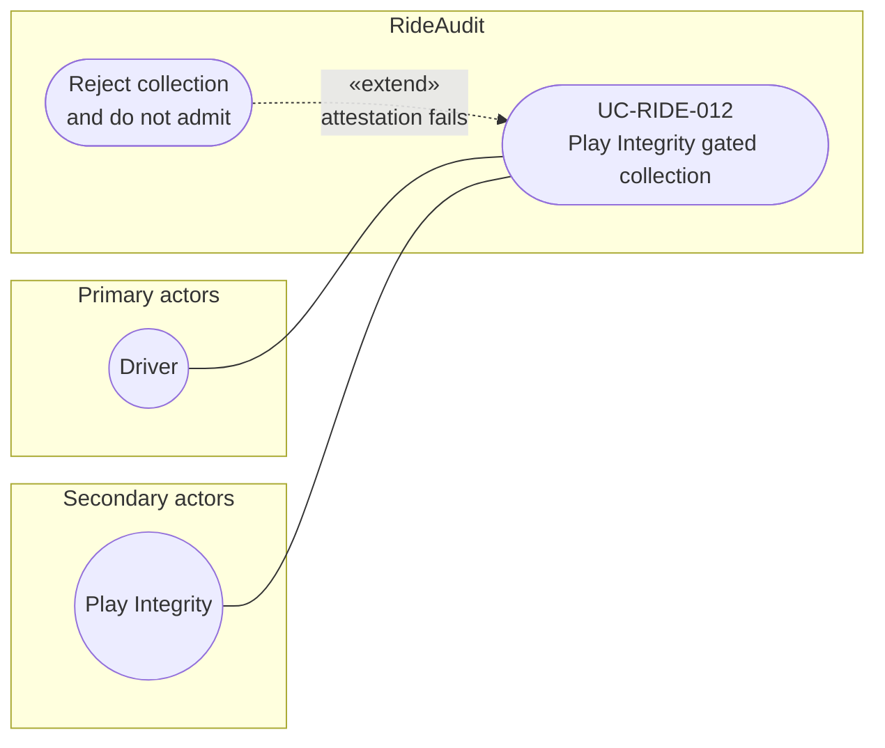

# UC-RIDE-012: Play Integrity gated collection

**Author:** Sharp Ninja
**License:** GPL-2.0
**Source:** `docs/Project/Use-Cases-Batch.yaml`
**Actors field:** Driver
**Realizes:** FR-RIDE-025, FR-RIDE-026, FR-RIDE-027, FR-RIDE-215

**Goal:** Bind keys to Play Integrity/signing cert; reject failed attestations before seal.

UML use case diagram. Notation is defined in [README.md](README.md). Session sequence diagrams under `docs/ux/flows/` are not a substitute for this diagram.

- Primary actors: Driver
- Secondary actors: Play Integrity

## Relationships

- «extend» rejection: basic flow step 4, on a failed allowlist or verdict, rejects collection and does not admit.
- Success (basic flow steps 1 through 3) requests a nonce-bound Integrity attestation, verifies the allowlisted package, cert, and verdict, then continues into scoped-key generation and seal.

## Constraints

- This diagram does not draw an «include» back to UC-RIDE-009. That seal use case already includes this gate, and a reverse include would cycle.

## Unverified gaps

None specific to this use case beyond the project rule: do not invent Lyft private APIs, and keep source Unverified caveats visible where they apply.

## Related

- Seal-at-collect includes this gate: [UC-RIDE-009](UC-RIDE-009.md).
