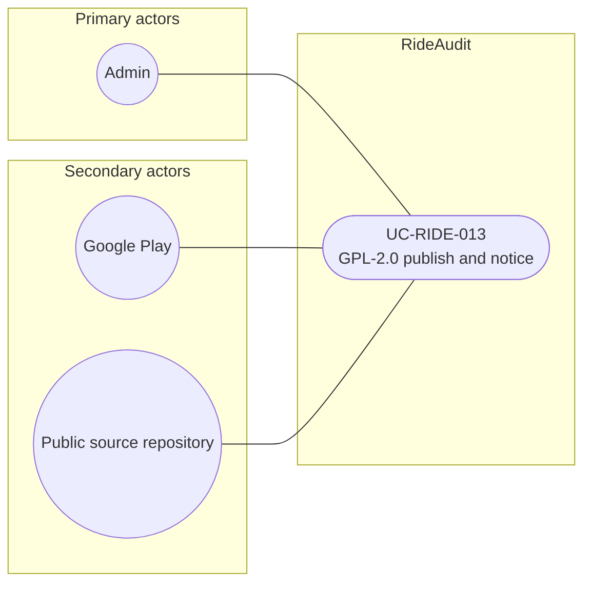

# UC-RIDE-013: GPL-2.0 publish and notice

**Author:** Sharp Ninja
**License:** GPL-2.0
**Source:** `docs/Project/Use-Cases-Batch.yaml`
**Actors field:** Admin
**Realizes:** FR-RIDE-029, FR-RIDE-030, FR-RIDE-031, FR-RIDE-217

**Goal:** Publish GPL-2.0 client/source and attach license metadata to shared artifacts without exposing sealed payloads.

UML use case diagram. Notation is defined in [README.md](README.md). Session sequence diagrams under `docs/ux/flows/` are not a substitute for this diagram.

- Primary actors: Admin
- Secondary actors: Google Play, Public source repository (SourceRepo)

## Relationships

- No «include» or «extend». The basic flow publishes the GPL-2.0 client through Google Play and the public source repository and attaches license metadata to schemas, receipts, and verification artifacts.

## Constraints

- License: GPL-2.0. Publishing source and notices does not publish sealed payloads. Sealed evidence stays access-controlled (basic flow step 4).
- Do not substitute Apache-2.0 or MIT for the in-scope client, schemas, or evidence-network code.

## Unverified gaps

None specific to this use case beyond the project rule: do not invent Lyft private APIs, and keep source Unverified caveats visible where they apply.

## Related

- Driver download of that client: [UC-RIDE-014](UC-RIDE-014.md).
- Shared Avalonia UI notices: [UC-RIDE-027](UC-RIDE-027.md). Proto publication consumption: [UC-RIDE-029](UC-RIDE-029.md).
