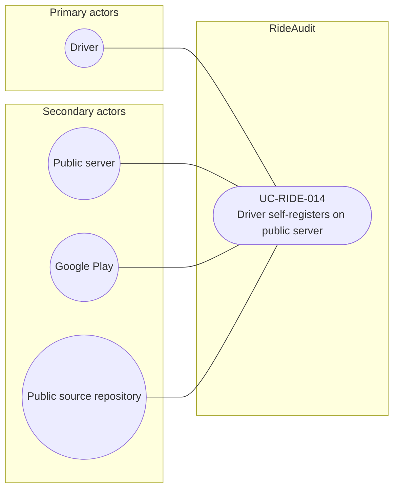

# UC-RIDE-014: Driver self-registers on public server

**Author:** Sharp Ninja
**License:** GPL-2.0
**Source:** `docs/Project/Use-Cases-Batch.yaml`
**Actors field:** Driver, PublicServer
**Realizes:** FR-RIDE-031, FR-RIDE-032, FR-RIDE-033, FR-RIDE-034

**Goal:** Driver downloads GPL2 client, creates account, records consent, registers vehicle and config profile.

UML use case diagram. Notation is defined in [README.md](README.md). Session sequence diagrams under `docs/ux/flows/` are not a substitute for this diagram.

- Primary actors: Driver
- Secondary actors: Public server (PublicServer), Google Play, Public source repository (SourceRepo)

## Relationships

- No «include» or «extend». Basic flow: download the client from Google Play or the source repository, create an account with consent, jurisdiction, and purpose, register the vehicle, select a valid configuration profile, and the public server admits the account and vehicle.

## Constraints

- The client is the GPL-2.0 client from UC-RIDE-013. Download is not itself the publish use case, so this diagram does not «include» UC-RIDE-013.

## Unverified gaps

None specific to this use case beyond the project rule: do not invent Lyft private APIs, and keep source Unverified caveats visible where they apply.

## Related

- Publish: [UC-RIDE-013](UC-RIDE-013.md).
