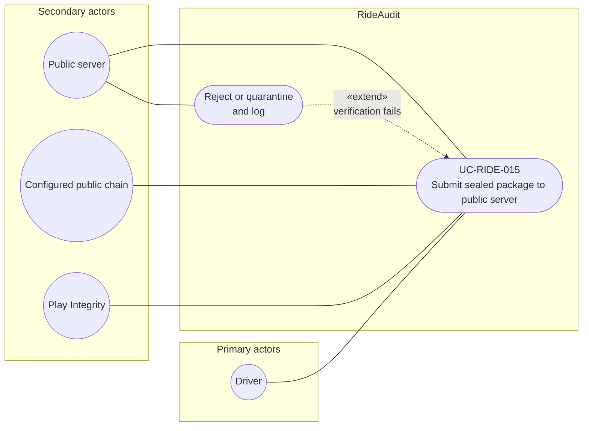

# UC-RIDE-015: Submit sealed package to public server

**Author:** Sharp Ninja
**License:** GPL-2.0
**Source:** `docs/Project/Use-Cases-Batch.yaml`
**Actors field:** Driver, PublicServer
**Realizes:** FR-RIDE-035, FR-RIDE-036, FR-RIDE-037, FR-RIDE-039, FR-RIDE-040, FR-RIDE-218

**Goal:** Driver submits sealed ciphertext plus receipt metadata; server verifies and admits or quarantines.

UML use case diagram. Notation is defined in [README.md](README.md). Session sequence diagrams under `docs/ux/flows/` are not a substitute for this diagram.

- Primary actors: Driver
- Secondary actors: Public server (PublicServer), Configured public chain (PublicChain), Play Integrity

## Relationships

- «extend» reject or quarantine: basic flow step 4, when hash, chain, attestation, binding, or driver/vehicle/config checks fail. Plaintext or a missing receipt is rejected (step 2).
- Success indexes the admission (step 4). Chain and Play Integrity are secondary actors because the server verifies the on-chain receipt and the attestation.

## Constraints

- The server receives sealed ciphertext and receipt metadata only. It does not decrypt at ingest.
- These admission checks are not the counsel working-copy path in UC-RIDE-010.

## Unverified gaps

None specific to this use case beyond the project rule: do not invent Lyft private APIs, and keep source Unverified caveats visible where they apply.

## Related

- gRPC specialization: [UC-RIDE-028](UC-RIDE-028.md). gRPC fail-closed admission: [UC-RIDE-030](UC-RIDE-030.md).
- Included by the dual-phone stop path in [UC-RIDE-017](UC-RIDE-017.md) and [UC-RIDE-023](UC-RIDE-023.md).
