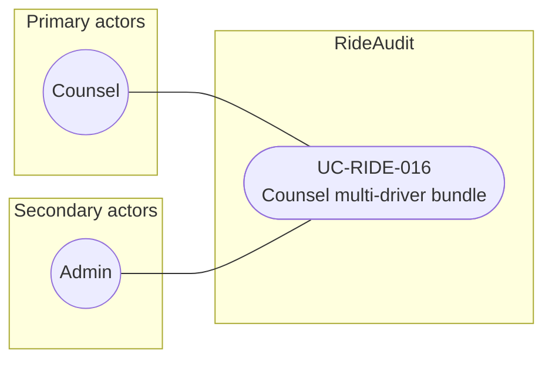

# UC-RIDE-016: Counsel multi-driver bundle

**Author:** Sharp Ninja
**License:** GPL-2.0
**Source:** `docs/Project/Use-Cases-Batch.yaml`
**Actors field:** Counsel, Admin
**Realizes:** FR-RIDE-037, FR-RIDE-038

**Goal:** Assemble independently admitted submissions from many drivers with per-record verification reports.

UML use case diagram. Notation is defined in [README.md](README.md). Session sequence diagrams under `docs/ux/flows/` are not a substitute for this diagram.

- Primary actors: Counsel
- Secondary actors: Admin

## Relationships

- No «include» or «extend». The basic flow selects authorized drivers and submissions, preserves per-record receipts and attestations, and attaches a VerificationReport per record.

## Constraints

- Aggregation does not weaken per-record custody (basic flow step 4).

## Unverified gaps

None specific to this use case beyond the project rule: do not invent Lyft private APIs, and keep source Unverified caveats visible where they apply.

## Related

- Verification that produces the counsel path: [UC-RIDE-010](UC-RIDE-010.md). ViewerSession and VerificationReport creation: [UC-RIDE-019](UC-RIDE-019.md). This bundle use case does not include those use cases; it attaches the per-record report the flow names.
