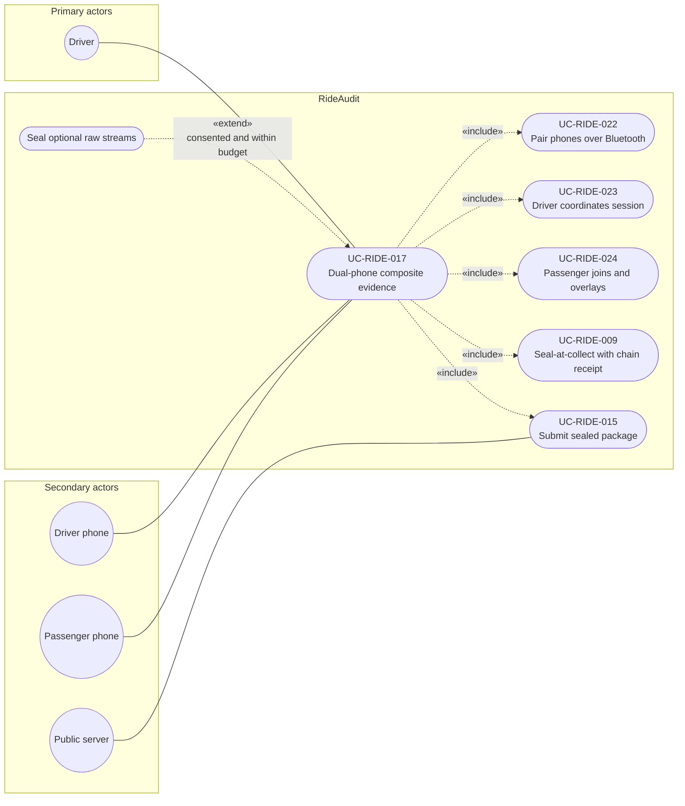

# UC-RIDE-017: Dual-phone composite evidence

**Author:** Sharp Ninja
**License:** GPL-2.0
**Source:** `docs/Project/Use-Cases-Batch.yaml`
**Actors field:** Driver
**Realizes:** FR-RIDE-041, FR-RIDE-042, FR-RIDE-043, FR-RIDE-044, FR-RIDE-045, FR-RIDE-046, FR-RIDE-048, FR-RIDE-219, FR-RIDE-220

**Goal:** Two phones capture, sync clocks, composite with spider graph on-device, seal composite, submit sealed package.

UML use case diagram. Notation is defined in [README.md](README.md). Session sequence diagrams under `docs/ux/flows/` are not a substitute for this diagram.

- Primary actors: Driver
- Secondary actors: Driver phone (DriverPhone), Passenger phone (PassengerPhone), Public server (PublicServer)

## Relationships

- «include» UC-RIDE-022: basic flow step 1, two approved phones join an authorized session.
- «include» UC-RIDE-023: basic flow step 2, shared clock and SyncClockOffset.
- «include» UC-RIDE-024: basic flow step 3, on-device composite with spider-graph overlay.
- «include» UC-RIDE-009: basic flow step 4, composite sealed at the device boundary with a chain receipt.
- «extend» optional raw streams: basic flow step 5, only when consented and within budget.
- «include» UC-RIDE-015: basic flow step 6, only sealed packages are submitted to the public server.

## Constraints

- The actors field names Driver. Driver phone and Passenger phone are secondary actors because the flow says two approved phones capture. Pairing is RideAudit Bluetooth pairing, not a Lyft Bluetooth API.
- Public server is associated with the included submit use case, not with plaintext upload.

## Unverified gaps

None specific to this use case beyond the project rule: do not invent Lyft private APIs, and keep source Unverified caveats visible where they apply.

## Related

- Phone-role detail: [UC-RIDE-022](UC-RIDE-022.md), [UC-RIDE-023](UC-RIDE-023.md), [UC-RIDE-024](UC-RIDE-024.md).
- Avalonia client specialization: [UC-RIDE-025](UC-RIDE-025.md).
