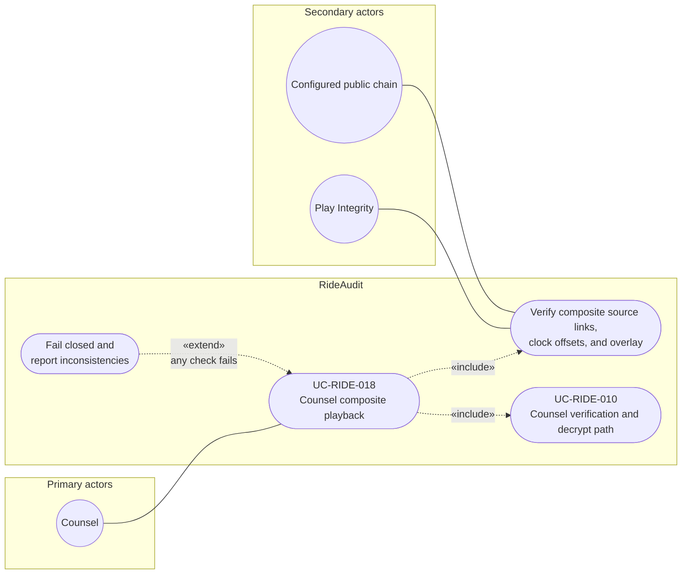

# UC-RIDE-018: Counsel composite playback

**Author:** Sharp Ninja
**License:** GPL-2.0
**Source:** `docs/Project/Use-Cases-Batch.yaml`
**Actors field:** Counsel
**Realizes:** FR-RIDE-047, FR-RIDE-048, FR-RIDE-050, FR-RIDE-221

**Goal:** Verify composite integrity then play expiring working copy.

UML use case diagram. Notation is defined in [README.md](README.md). Session sequence diagrams under `docs/ux/flows/` are not a substitute for this diagram.

- Primary actors: Counsel
- Secondary actors: Configured public chain (PublicChain), Play Integrity

## Relationships

- «include» composite checks: basic flow step 2 adds source links, clock offsets, and overlay checks on top of hash, receipt, and attestation.
- «include» UC-RIDE-010: the brief and step 3 play an expiring working copy through the documented verification and decrypt path.
- «extend» fail closed: basic flow step 4, on any failure, fails closed and reports inconsistencies. No playback in that case.

## Constraints

- Configured public chain and Play Integrity participate in the composite verification include, matching the receipt and attestation checks in step 2.

## Unverified gaps

None specific to this use case beyond the project rule: do not invent Lyft private APIs, and keep source Unverified caveats visible where they apply.

## Related

- Decrypt path: [UC-RIDE-010](UC-RIDE-010.md). Desktop timeline review: [UC-RIDE-019](UC-RIDE-019.md).
