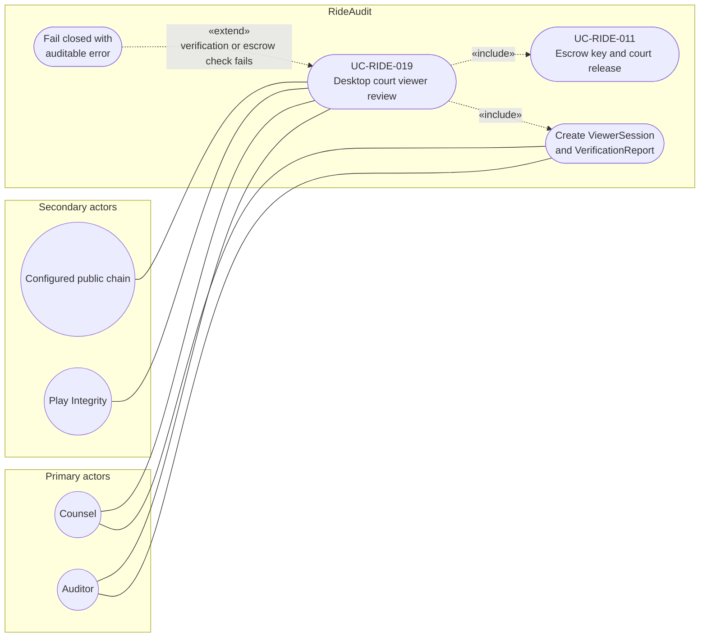

# UC-RIDE-019: Desktop court viewer review

**Author:** Sharp Ninja
**License:** GPL-2.0
**Source:** `docs/Project/Use-Cases-Batch.yaml`
**Actors field:** Counsel, Auditor
**Realizes:** FR-RIDE-028, FR-RIDE-049, FR-RIDE-050, FR-RIDE-051, FR-RIDE-052, FR-RIDE-222

**Goal:** Reviewer uses GPL2 desktop viewer to verify and display RideBundle via escrow release path.

UML use case diagram. Notation is defined in [README.md](README.md). Session sequence diagrams under `docs/ux/flows/` are not a substitute for this diagram.

- Primary actors: Counsel, Auditor
- Secondary actors: Configured public chain (PublicChain), Play Integrity

## Relationships

- «include» UC-RIDE-011: basic flow step 3 decrypts only via escrow release.
- «include» ViewerSession and VerificationReport: basic flow step 4 creates both for every review.
- «extend» fail closed: basic flow step 5, on failure, fails closed with an auditable error. No timeline display in that case.
- Receipt, hash, and Play attestation checks (step 2) are this use case, with the configured public chain and Play Integrity as secondary actors. The synchronized timeline is the success display (step 3).

## Constraints

- GPL-2.0 desktop viewer on Windows, Linux, and macOS. Decrypt never bypasses escrow.

## Unverified gaps

None specific to this use case beyond the project rule: do not invent Lyft private APIs, and keep source Unverified caveats visible where they apply.

## Related

- Avalonia UI 12 specialization: [UC-RIDE-026](UC-RIDE-026.md).
- Counsel decrypt path aligned with this review: [UC-RIDE-010](UC-RIDE-010.md). This diagram includes escrow (UC-RIDE-011) directly because step 3 names escrow release.
