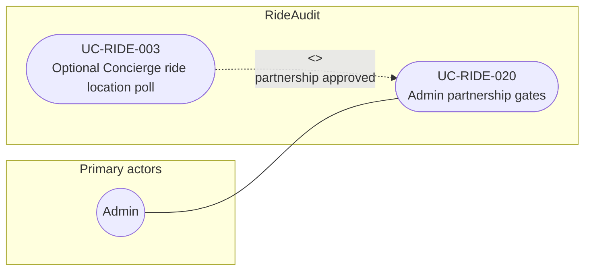

# UC-RIDE-020: Admin partnership gates

**Author:** Sharp Ninja
**License:** GPL-2.0
**Source:** `docs/Project/Use-Cases-Batch.yaml`
**Actors field:** Admin
**Realizes:** FR-RIDE-011, FR-RIDE-012

**Goal:** Admin sets Business API partnership status and Concierge features follow that gate.

UML use case diagram. Notation is defined in [README.md](README.md). Session sequence diagrams under `docs/ux/flows/` are not a substitute for this diagram.

- Primary actors: Admin
- Secondary actors: None.

## Relationships

- <<extend>> UC-RIDE-003: basic flow enables Concierge features when the partnership is approved. The same arrow is on the UC-RIDE-003 diagram.
- Denied partnership leaves Concierge disabled.

## Constraints

- Setting partnership status is an admin gate in RideAudit. This use case does not poll Concierge and does not add Lyft endpoints.
- FR-RIDE-011 remains linked: this gate must not be implemented via undocumented Lyft private APIs, credential stuffing, or traffic interception.

## Unverified gaps

None specific to this use case beyond the project rule: do not invent Lyft private APIs, and keep source Unverified caveats visible where they apply.

## Related

- Optional poll: [UC-RIDE-003](UC-RIDE-003.md).
