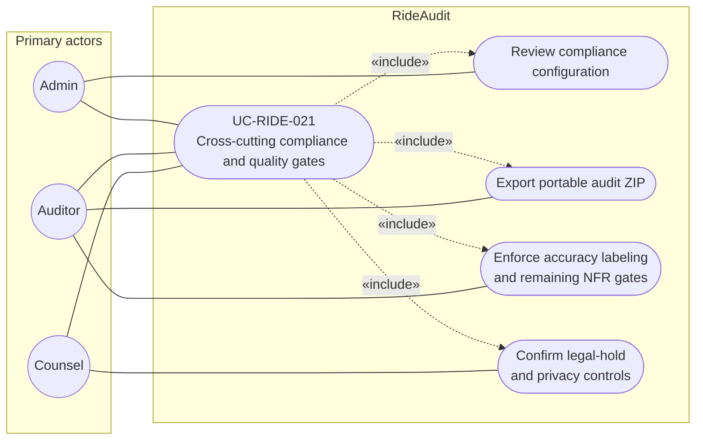

# UC-RIDE-021: Cross-cutting compliance and quality gates

**Author:** Sharp Ninja
**License:** GPL-2.0
**Source:** `docs/Project/Use-Cases-Batch.yaml`
**Actors field:** Admin, Auditor, Counsel
**Realizes:** FR-RIDE-205, FR-RIDE-207

**Goal:** Covers remaining NFRs for accuracy labeling, portability export, and related cross-cutting controls.

UML use case diagram. Notation is defined in [README.md](README.md). Session sequence diagrams under `docs/ux/flows/` are not a substitute for this diagram.

- Primary actors: Admin, Auditor, Counsel
- Secondary actors: None.

## Relationships

- «include» review compliance configuration: basic flow step 1, Admin.
- «include» portable audit ZIP: basic flow step 2, Auditor.
- «include» accuracy labeling and remaining NFR gates: basic flow step 3.
- «include» confirm legal-hold and privacy controls: basic flow step 4, Counsel. This confirms the controls. It does not perform DSAR deletion.

## Constraints

- Accuracy labeling keeps derived or sparse location metrics distinct from Smooth Cruiser.

## Unverified gaps

Where source data is missing, accuracy labeling stays visible. Do not fill gaps with undocumented Lyft APIs.

## Related

- DSAR access and deletion under legal hold: [UC-RIDE-008](UC-RIDE-008.md).
