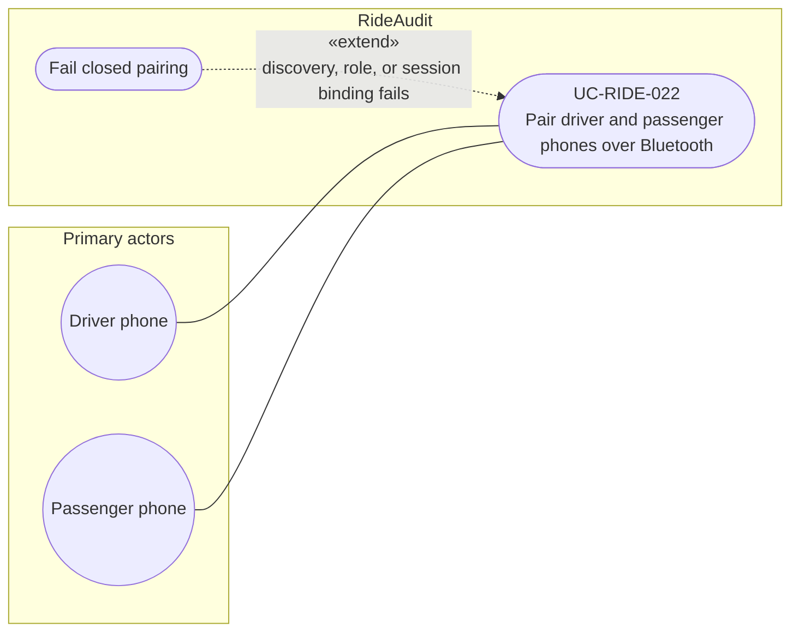

# UC-RIDE-022: Pair driver and passenger phones over Bluetooth

**Author:** Sharp Ninja
**License:** GPL-2.0
**Source:** `docs/Project/Use-Cases-Batch.yaml`
**Actors field:** DriverPhone, PassengerPhone
**Realizes:** FR-RIDE-053

**Goal:** Driver and passenger phones discover each other via Bluetooth and confirm roles for one session.

UML use case diagram. Notation is defined in [README.md](README.md). Session sequence diagrams under `docs/ux/flows/` are not a substitute for this diagram.

- Primary actors: Driver phone (DriverPhone), Passenger phone (PassengerPhone)
- Secondary actors: None.

## Relationships

- «extend» fail closed: basic flow step 4, pairing completes or fails closed. Failure covers Bluetooth discovery, role confirmation, or session binding.

## Constraints

- This is RideAudit device pairing between the driver phone and the passenger phone. It is not a Lyft Bluetooth API.

## Unverified gaps

None specific to this use case beyond the project rule: do not invent Lyft private APIs, and keep source Unverified caveats visible where they apply.

## Related

- Included by [UC-RIDE-017](UC-RIDE-017.md) and [UC-RIDE-025](UC-RIDE-025.md).
- Precondition of [UC-RIDE-023](UC-RIDE-023.md) (that flow starts after pairing; it does not «include» this use case).
