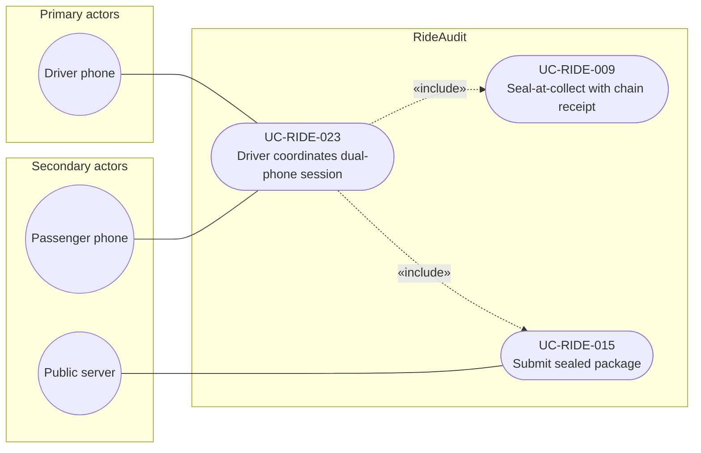

# UC-RIDE-023: Driver coordinates dual-phone session

**Author:** Sharp Ninja
**License:** GPL-2.0
**Source:** `docs/Project/Use-Cases-Batch.yaml`
**Actors field:** DriverPhone, PassengerPhone
**Realizes:** FR-RIDE-054

**Goal:** Driver phone starts session clock and coordinates capture lifecycle.

UML use case diagram. Notation is defined in [README.md](README.md). Session sequence diagrams under `docs/ux/flows/` are not a substitute for this diagram.

- Primary actors: Driver phone (DriverPhone)
- Secondary actors: Passenger phone (PassengerPhone), Public server (PublicServer)

## Relationships

- «include» UC-RIDE-009 and UC-RIDE-015: basic flow step 3, when the driver phone stops or aborts the session it triggers seal and submit orchestration.
- Publishing the session clock and coordination commands (step 2) is this use case. The passenger phone is secondary because it receives those commands.

## Constraints

- Precondition, not an «include»: pairing in UC-RIDE-022 is already complete before step 1 starts the session.
- Only the driver-role phone starts or stops the session.

## Unverified gaps

None specific to this use case beyond the project rule: do not invent Lyft private APIs, and keep source Unverified caveats visible where they apply.

## Related

- Pairing precondition: [UC-RIDE-022](UC-RIDE-022.md). Parent composite: [UC-RIDE-017](UC-RIDE-017.md).
