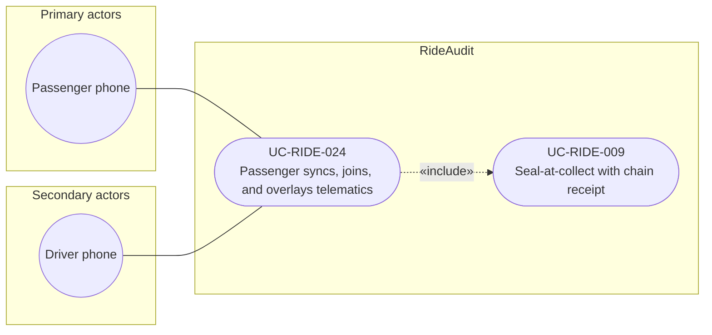

# UC-RIDE-024: Passenger syncs joins and overlays telematics

**Author:** Sharp Ninja
**License:** GPL-2.0
**Source:** `docs/Project/Use-Cases-Batch.yaml`
**Actors field:** PassengerPhone
**Realizes:** FR-RIDE-055

**Goal:** Passenger phone syncs video, joins streams, and overlays realtime telematics.

UML use case diagram. Notation is defined in [README.md](README.md). Session sequence diagrams under `docs/ux/flows/` are not a substitute for this diagram.

- Primary actors: Passenger phone (PassengerPhone)
- Secondary actors: Driver phone (DriverPhone)

## Relationships

- «include» UC-RIDE-009: basic flow step 4 seals the composite at collect on the composite path.
- Steps 1 through 3 (follow the driver session clock, sync and join dual video, overlay the realtime telematics spider graph) are this use case. Driver phone is secondary because the passenger follows the driver-published clock.

## Constraints

- The clock master is UC-RIDE-023. This use case follows that clock. It does not «include» the whole driver coordination use case (start, stop, and submit).
- Telematics overlay is RideAudit capture on the passenger phone, not a Lyft telematics API.

## Unverified gaps

None specific to this use case beyond the project rule: do not invent Lyft private APIs, and keep source Unverified caveats visible where they apply.

## Related

- Driver clock: [UC-RIDE-023](UC-RIDE-023.md). Seal: [UC-RIDE-009](UC-RIDE-009.md).
