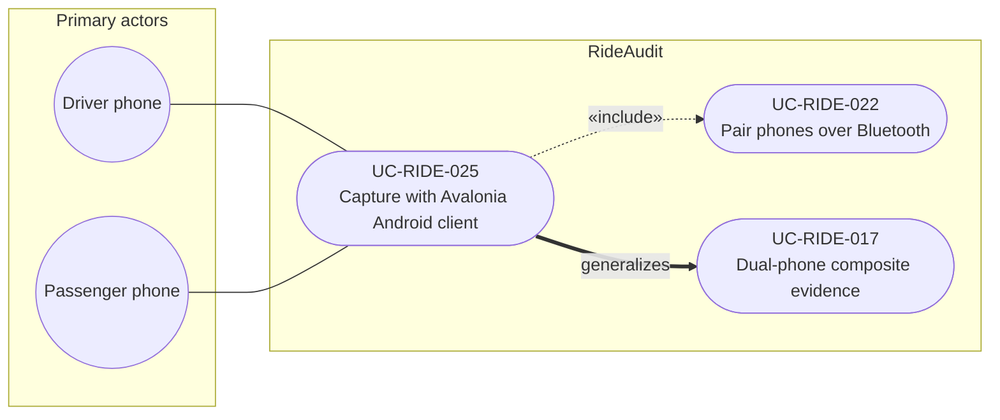

# UC-RIDE-025: Capture ride evidence with Avalonia Android client

**Author:** Sharp Ninja
**License:** GPL-2.0
**Source:** `docs/Project/Use-Cases-Batch.yaml`
**Actors field:** DriverPhone, PassengerPhone
**Realizes:** FR-RIDE-056

**Goal:** Driver and passenger use the Avalonia UI 12 Android client for dual-phone capture roles.

UML use case diagram. Notation is defined in [README.md](README.md). Session sequence diagrams under `docs/ux/flows/` are not a substitute for this diagram.

- Primary actors: Driver phone (DriverPhone), Passenger phone (PassengerPhone)
- Secondary actors: None.

## Relationships

- «include» UC-RIDE-022: basic flow step 2, driver and passenger select roles and complete pairing.
- generalizes UC-RIDE-017: this use case is the Avalonia UI 12 Android realization of dual-phone composite capture. Step 3 says capture proceeds with Avalonia UI surfaces for the primary screens.

## Constraints

- UI stack for primary capture screens is Avalonia UI 12. License GPL-2.0. Pairing remains RideAudit Bluetooth pairing.

## Unverified gaps

None specific to this use case beyond the project rule: do not invent Lyft private APIs, and keep source Unverified caveats visible where they apply.

## Related

- General use case: [UC-RIDE-017](UC-RIDE-017.md). Pairing: [UC-RIDE-022](UC-RIDE-022.md).
