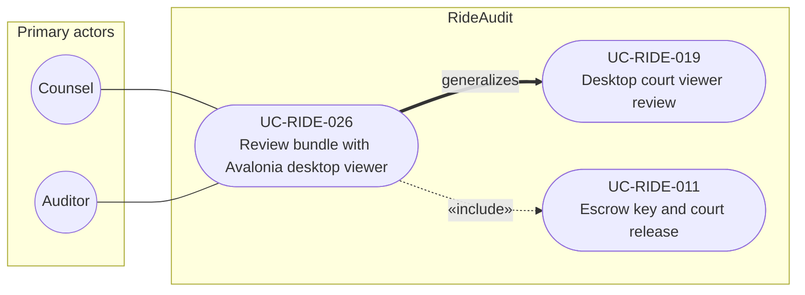

# UC-RIDE-026: Review sealed bundle with Avalonia desktop viewer

**Author:** Sharp Ninja
**License:** GPL-2.0
**Source:** `docs/Project/Use-Cases-Batch.yaml`
**Actors field:** Counsel, Auditor
**Realizes:** FR-RIDE-057

**Goal:** Counsel or auditor opens a RideBundle in the Avalonia UI 12 desktop court viewer.

UML use case diagram. Notation is defined in [README.md](README.md). Session sequence diagrams under `docs/ux/flows/` are not a substitute for this diagram.

- Primary actors: Counsel, Auditor
- Secondary actors: None.

## Relationships

- generalizes UC-RIDE-019: basic flow step 1 is the desktop court viewer review on Avalonia UI 12 for Windows, Linux, or macOS.
- «include» UC-RIDE-011: basic flow step 2 verifies, then decrypts only via escrow release. Step 3 inspects the synchronized timeline after that release.

## Constraints

- Fail closed if escrow release is not authorized. The viewer does not decrypt at rest or bypass escrow.

## Unverified gaps

None specific to this use case beyond the project rule: do not invent Lyft private APIs, and keep source Unverified caveats visible where they apply.

## Related

- Product review use case: [UC-RIDE-019](UC-RIDE-019.md). Escrow: [UC-RIDE-011](UC-RIDE-011.md).
