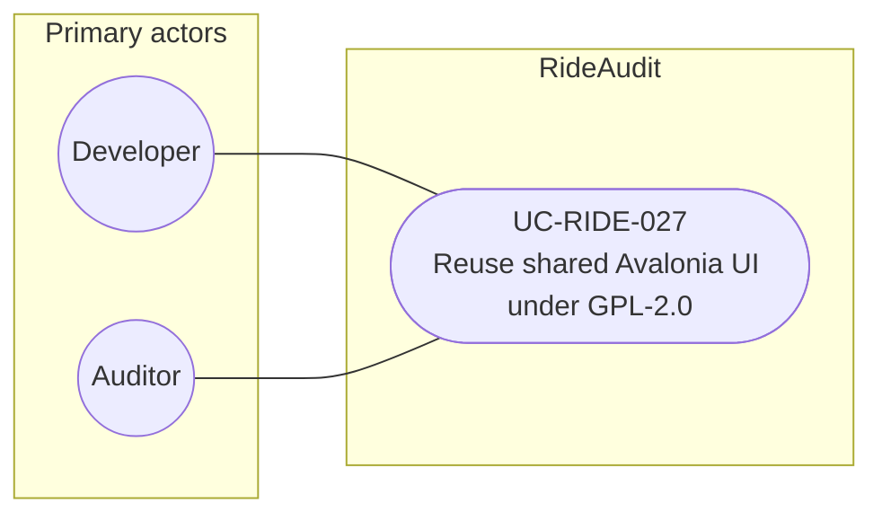

# UC-RIDE-027: Reuse shared Avalonia UI under GPL-2.0

**Author:** Sharp Ninja
**License:** GPL-2.0
**Source:** `docs/Project/Use-Cases-Batch.yaml`
**Actors field:** Developer, Auditor
**Realizes:** FR-RIDE-058

**Goal:** Shared Avalonia UI 12 libraries serve Android and desktop under GPL-2.0.

UML use case diagram. Notation is defined in [README.md](README.md). Session sequence diagrams under `docs/ux/flows/` are not a substitute for this diagram.

- Primary actors: Developer, Auditor
- Secondary actors: None.

## Relationships

- No «include» or «extend». The basic flow consumes the shared Avalonia UI 12 package from the GPL-2.0 tree, references it from the Android and desktop apps, and keeps license notices on published artifacts.

## Constraints

- License GPL-2.0 for the shared UI. Notices staying present aligns with UC-RIDE-013 but this use case is consumption and reuse, so it does not «include» the admin publish use case.

## Unverified gaps

None specific to this use case beyond the project rule: do not invent Lyft private APIs, and keep source Unverified caveats visible where they apply.

## Related

- Publish and notices: [UC-RIDE-013](UC-RIDE-013.md).
