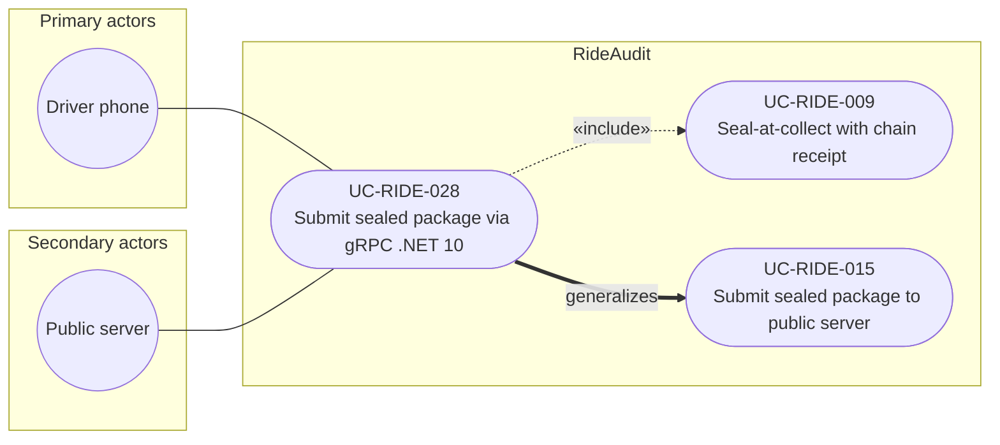

# UC-RIDE-028: Submit sealed package via gRPC .NET 10

**Author:** Sharp Ninja
**License:** GPL-2.0
**Source:** `docs/Project/Use-Cases-Batch.yaml`
**Actors field:** DriverPhone, PublicServer
**Realizes:** FR-RIDE-059

**Goal:** Driver phone submits a sealed ciphertext package to the gRPC backend on .NET 10 containers.

UML use case diagram. Notation is defined in [README.md](README.md). Session sequence diagrams under `docs/ux/flows/` are not a substitute for this diagram.

- Primary actors: Driver phone (DriverPhone)
- Secondary actors: Public server (PublicServer)

## Relationships

- «include» UC-RIDE-009: basic flow step 1, the client seals the package on the device before submit.
- generalizes UC-RIDE-015: steps 2 and 3 are sealed submit to the public server, here over gRPC on .NET 10 containers.

## Constraints

- The server stores ciphertext only and never decrypts at ingest (basic flow step 3).

## Unverified gaps

None specific to this use case beyond the project rule: do not invent Lyft private APIs, and keep source Unverified caveats visible where they apply.

## Related

- General submit: [UC-RIDE-015](UC-RIDE-015.md). Fail-closed gRPC admission extends this use case: [UC-RIDE-030](UC-RIDE-030.md).
