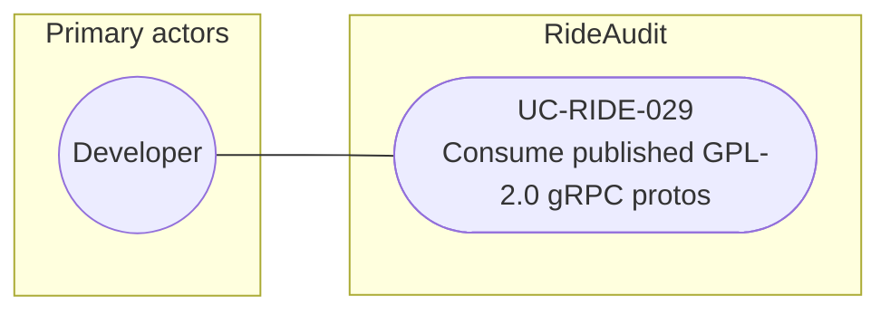

# UC-RIDE-029: Consume published GPL-2.0 gRPC protos

**Author:** Sharp Ninja
**License:** GPL-2.0
**Source:** `docs/Project/Use-Cases-Batch.yaml`
**Actors field:** Developer
**Realizes:** FR-RIDE-060

**Goal:** Clients and forks build against published GPL-2.0 protobuf contracts.

UML use case diagram. Notation is defined in [README.md](README.md). Session sequence diagrams under `docs/ux/flows/` are not a substitute for this diagram.

- Primary actors: Developer
- Secondary actors: None.

## Relationships

- No «include» or «extend». The basic flow obtains the published proto and schema package and binds client codegen to the versioned gRPC contracts.

## Constraints

- License GPL-2.0 for the published protos. No undocumented Lyft private APIs are invented (basic flow step 3).

## Unverified gaps

None specific to this use case beyond the project rule: do not invent Lyft private APIs, and keep source Unverified caveats visible where they apply.

## Related

- Included by [UC-RIDE-031](UC-RIDE-031.md) when conformance and codegen bind to gRPC.
- Admin publish of GPL-2.0 artifacts: [UC-RIDE-013](UC-RIDE-013.md). This use case consumes the published contract. It does not include the publish use case.
