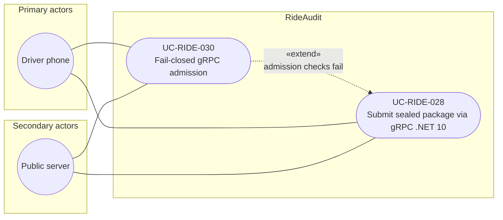

# UC-RIDE-030: Fail-closed gRPC admission

**Author:** Sharp Ninja
**License:** GPL-2.0
**Source:** `docs/Project/Use-Cases-Batch.yaml`
**Actors field:** DriverPhone, PublicServer
**Realizes:** FR-RIDE-061

**Goal:** Public server rejects invalid sealed submits over gRPC without admitting storage.

UML use case diagram. Notation is defined in [README.md](README.md). Session sequence diagrams under `docs/ux/flows/` are not a substitute for this diagram.

- Primary actors: Driver phone (DriverPhone)
- Secondary actors: Public server (PublicServer)

## Relationships

- «extend» UC-RIDE-028: the client has submitted a sealed package over gRPC (steps 1 and 2). This use case adds the failure path: the RPC rejects and nothing is admitted (step 3).

## Constraints

- Fail closed means no admitted package is stored. This is the gRPC form of the reject-or-quarantine outcome on UC-RIDE-015.

## Unverified gaps

None specific to this use case beyond the project rule: do not invent Lyft private APIs, and keep source Unverified caveats visible where they apply.

## Related

- Base gRPC submit: [UC-RIDE-028](UC-RIDE-028.md). Product submit failure outcome: [UC-RIDE-015](UC-RIDE-015.md).
