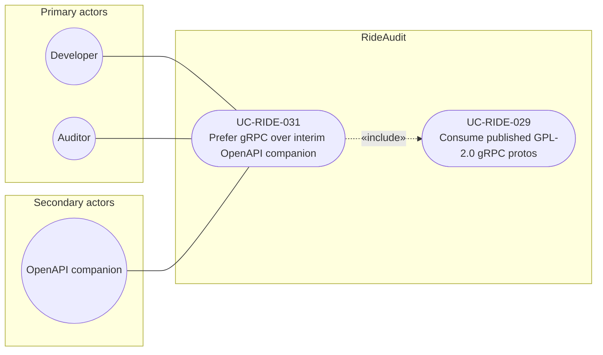

# UC-RIDE-031: Prefer gRPC over interim OpenAPI companion

**Author:** Sharp Ninja
**License:** GPL-2.0
**Source:** `docs/Project/Use-Cases-Batch.yaml`
**Actors field:** Developer, Auditor
**Realizes:** FR-RIDE-062

**Goal:** When OpenAPI and gRPC disagree, clients and tests follow gRPC contracts.

UML use case diagram. Notation is defined in [README.md](README.md). Session sequence diagrams under `docs/ux/flows/` are not a substitute for this diagram.

- Primary actors: Developer, Auditor
- Secondary actors: OpenAPI companion (OpenApiCompanion)

## Relationships

- «include» UC-RIDE-029: basic flow step 2 binds conformance and codegen to the gRPC protos.
- The OpenAPI companion is a secondary actor for human reading (step 1). Step 3 resolves disagreement in favor of gRPC. That resolution is this use case, not an optional extension.

## Constraints

- The OpenAPI companion is non-authoritative. It is not a Lyft API and it is not a second source of ride-telematics endpoints.

## Unverified gaps

None specific to this use case beyond the project rule: do not invent Lyft private APIs, and keep source Unverified caveats visible where they apply.

## Related

- Proto consumption: [UC-RIDE-029](UC-RIDE-029.md).
