# RideAudit use case overview

**Author:** Sharp Ninja
**License:** GPL-2.0

All actors drawn on the per-use-case diagrams, and all 31 use cases, inside the RideAudit boundary. Packages match the use case groups in `docs/Project/Use-Cases-Batch.yaml`. Associations here connect each actor to the use case whose diagram shows that actor. Include, extend, and generalization stay on the per-use-case pages so this view stays at the boundary.

Index: [README.md](README.md).

```mermaid
%% RideAudit UML use case overview
flowchart TB
  subgraph actors["Actors"]
    direction LR
    A_Driver((Driver))
    A_Auditor((Auditor))
    A_Admin((Admin))
    A_ConciergeApi((Lyft Concierge status API))
    A_ThirdParty((Third-party telematics source))
    A_Counsel((Counsel))
    A_PublicServer((Public server))
    A_PublicChain((Configured public chain))
    A_PlayIntegrity((Play Integrity))
    A_Court((Court))
    A_Custodian((Custodian))
    A_GooglePlay((Google Play))
    A_SourceRepo((Public source repository))
    A_DriverPhone((Driver phone))
    A_PassengerPhone((Passenger phone))
    A_Developer((Developer))
    A_OpenApiCompanion((OpenAPI companion))
  end
  subgraph rideaudit["RideAudit"]
    subgraph ingest["Ingest"]
      direction TB
      N001(["UC-RIDE-001<br/>Ingest privacy-export ZIP"])
      N002(["UC-RIDE-002<br/>Record Smooth Cruiser evidence"])
      N003(["UC-RIDE-003<br/>Optional Concierge ride location poll"])
      N004(["UC-RIDE-004<br/>Import third-party telematics"])
    end
    subgraph analysis["Analysis and subject requests"]
      direction TB
      N005(["UC-RIDE-005<br/>Generate coverage matrix"])
      N006(["UC-RIDE-006<br/>Online-hours policy check"])
      N007(["UC-RIDE-007<br/>Build incident time-window package"])
      N008(["UC-RIDE-008<br/>Data subject access or deletion"])
    end
    subgraph custody["Seal, integrity, and escrow"]
      direction TB
      N009(["UC-RIDE-009<br/>Seal-at-collect with chain receipt"])
      N010(["UC-RIDE-010<br/>Counsel verification and decrypt path"])
      N011(["UC-RIDE-011<br/>Escrow key and court release"])
      N012(["UC-RIDE-012<br/>Play Integrity gated collection"])
    end
    subgraph publish["GPL-2.0 publish and registration"]
      direction TB
      N013(["UC-RIDE-013<br/>GPL-2.0 publish and notice"])
      N014(["UC-RIDE-014<br/>Driver self-registers on public server"])
    end
    subgraph server["Public server"]
      direction TB
      N015(["UC-RIDE-015<br/>Submit sealed package to public server"])
      N016(["UC-RIDE-016<br/>Counsel multi-driver bundle"])
      N020(["UC-RIDE-020<br/>Admin RBAC and partnership gates"])
    end
    subgraph video["Dual-phone evidence"]
      direction TB
      N017(["UC-RIDE-017<br/>Dual-phone composite evidence"])
      N018(["UC-RIDE-018<br/>Counsel composite playback"])
      N019(["UC-RIDE-019<br/>Desktop court viewer review"])
      N022(["UC-RIDE-022<br/>Pair driver and passenger phones over Bluetooth"])
      N023(["UC-RIDE-023<br/>Driver coordinates dual-phone session"])
      N024(["UC-RIDE-024<br/>Passenger syncs joins and overlays telematics"])
    end
    subgraph compliance["Compliance"]
      direction TB
      N021(["UC-RIDE-021<br/>Cross-cutting compliance and quality gates"])
    end
    subgraph stack["Avalonia UI 12 and gRPC"]
      direction TB
      N025(["UC-RIDE-025<br/>Capture ride evidence with Avalonia Android client"])
      N026(["UC-RIDE-026<br/>Review sealed bundle with Avalonia desktop viewer"])
      N027(["UC-RIDE-027<br/>Reuse shared Avalonia UI under GPL-2.0"])
      N028(["UC-RIDE-028<br/>Submit sealed package via gRPC .NET 10"])
      N029(["UC-RIDE-029<br/>Consume published GPL-2.0 gRPC protos"])
      N030(["UC-RIDE-030<br/>Fail-closed gRPC admission"])
      N031(["UC-RIDE-031<br/>Prefer gRPC over interim OpenAPI companion"])
    end
  end
  A_Driver --- N001
  A_Auditor --- N001
  A_Driver --- N002
  A_Auditor --- N002
  A_Admin --- N003
  A_Auditor --- N003
  A_ConciergeApi --- N003
  A_Driver --- N004
  A_Auditor --- N004
  A_ThirdParty --- N004
  A_Auditor --- N005
  A_Counsel --- N005
  A_Auditor --- N006
  A_Auditor --- N007
  A_Counsel --- N007
  A_Driver --- N008
  A_Admin --- N008
  A_Counsel --- N008
  A_Driver --- N009
  A_PublicServer --- N009
  A_PublicChain --- N009
  A_Counsel --- N010
  A_Admin --- N010
  A_PublicChain --- N010
  A_PlayIntegrity --- N010
  A_Admin --- N011
  A_Counsel --- N011
  A_Court --- N011
  A_Custodian --- N011
  A_Driver --- N012
  A_PlayIntegrity --- N012
  A_Admin --- N013
  A_GooglePlay --- N013
  A_SourceRepo --- N013
  A_Driver --- N014
  A_PublicServer --- N014
  A_GooglePlay --- N014
  A_SourceRepo --- N014
  A_Driver --- N015
  A_PublicServer --- N015
  A_PublicChain --- N015
  A_PlayIntegrity --- N015
  A_Counsel --- N016
  A_Admin --- N016
  A_Driver --- N017
  A_DriverPhone --- N017
  A_PassengerPhone --- N017
  A_PublicServer --- N017
  A_Counsel --- N018
  A_PublicChain --- N018
  A_PlayIntegrity --- N018
  A_Counsel --- N019
  A_Auditor --- N019
  A_PublicChain --- N019
  A_PlayIntegrity --- N019
  A_Admin --- N020
  A_Admin --- N021
  A_Auditor --- N021
  A_Counsel --- N021
  A_DriverPhone --- N022
  A_PassengerPhone --- N022
  A_DriverPhone --- N023
  A_PassengerPhone --- N023
  A_PublicServer --- N023
  A_PassengerPhone --- N024
  A_DriverPhone --- N024
  A_DriverPhone --- N025
  A_PassengerPhone --- N025
  A_Counsel --- N026
  A_Auditor --- N026
  A_Developer --- N027
  A_Auditor --- N027
  A_DriverPhone --- N028
  A_PublicServer --- N028
  A_Developer --- N029
  A_DriverPhone --- N030
  A_PublicServer --- N030
  A_Developer --- N031
  A_Auditor --- N031
  A_OpenApiCompanion --- N031
```

## Actor to use case

| Actor | Use cases |
| --- | --- |
| Driver | [UC-RIDE-001](UC-RIDE-001.md), [UC-RIDE-002](UC-RIDE-002.md), [UC-RIDE-004](UC-RIDE-004.md), [UC-RIDE-008](UC-RIDE-008.md), [UC-RIDE-009](UC-RIDE-009.md), [UC-RIDE-012](UC-RIDE-012.md), [UC-RIDE-014](UC-RIDE-014.md), [UC-RIDE-015](UC-RIDE-015.md), [UC-RIDE-017](UC-RIDE-017.md) |
| Auditor | [UC-RIDE-001](UC-RIDE-001.md), [UC-RIDE-002](UC-RIDE-002.md), [UC-RIDE-003](UC-RIDE-003.md), [UC-RIDE-004](UC-RIDE-004.md), [UC-RIDE-005](UC-RIDE-005.md), [UC-RIDE-006](UC-RIDE-006.md), [UC-RIDE-007](UC-RIDE-007.md), [UC-RIDE-019](UC-RIDE-019.md), [UC-RIDE-021](UC-RIDE-021.md), [UC-RIDE-026](UC-RIDE-026.md), [UC-RIDE-027](UC-RIDE-027.md), [UC-RIDE-031](UC-RIDE-031.md) |
| Admin | [UC-RIDE-003](UC-RIDE-003.md), [UC-RIDE-008](UC-RIDE-008.md), [UC-RIDE-010](UC-RIDE-010.md), [UC-RIDE-011](UC-RIDE-011.md), [UC-RIDE-013](UC-RIDE-013.md), [UC-RIDE-016](UC-RIDE-016.md), [UC-RIDE-020](UC-RIDE-020.md), [UC-RIDE-021](UC-RIDE-021.md) |
| Lyft Concierge status API | [UC-RIDE-003](UC-RIDE-003.md) |
| Third-party telematics source | [UC-RIDE-004](UC-RIDE-004.md) |
| Counsel | [UC-RIDE-005](UC-RIDE-005.md), [UC-RIDE-007](UC-RIDE-007.md), [UC-RIDE-008](UC-RIDE-008.md), [UC-RIDE-010](UC-RIDE-010.md), [UC-RIDE-011](UC-RIDE-011.md), [UC-RIDE-016](UC-RIDE-016.md), [UC-RIDE-018](UC-RIDE-018.md), [UC-RIDE-019](UC-RIDE-019.md), [UC-RIDE-021](UC-RIDE-021.md), [UC-RIDE-026](UC-RIDE-026.md) |
| Public server | [UC-RIDE-009](UC-RIDE-009.md), [UC-RIDE-014](UC-RIDE-014.md), [UC-RIDE-015](UC-RIDE-015.md), [UC-RIDE-017](UC-RIDE-017.md), [UC-RIDE-023](UC-RIDE-023.md), [UC-RIDE-028](UC-RIDE-028.md), [UC-RIDE-030](UC-RIDE-030.md) |
| Configured public chain | [UC-RIDE-009](UC-RIDE-009.md), [UC-RIDE-010](UC-RIDE-010.md), [UC-RIDE-015](UC-RIDE-015.md), [UC-RIDE-018](UC-RIDE-018.md), [UC-RIDE-019](UC-RIDE-019.md) |
| Play Integrity | [UC-RIDE-010](UC-RIDE-010.md), [UC-RIDE-012](UC-RIDE-012.md), [UC-RIDE-015](UC-RIDE-015.md), [UC-RIDE-018](UC-RIDE-018.md), [UC-RIDE-019](UC-RIDE-019.md) |
| Court | [UC-RIDE-011](UC-RIDE-011.md) |
| Custodian | [UC-RIDE-011](UC-RIDE-011.md) |
| Google Play | [UC-RIDE-013](UC-RIDE-013.md), [UC-RIDE-014](UC-RIDE-014.md) |
| Public source repository | [UC-RIDE-013](UC-RIDE-013.md), [UC-RIDE-014](UC-RIDE-014.md) |
| Driver phone | [UC-RIDE-017](UC-RIDE-017.md), [UC-RIDE-022](UC-RIDE-022.md), [UC-RIDE-023](UC-RIDE-023.md), [UC-RIDE-024](UC-RIDE-024.md), [UC-RIDE-025](UC-RIDE-025.md), [UC-RIDE-028](UC-RIDE-028.md), [UC-RIDE-030](UC-RIDE-030.md) |
| Passenger phone | [UC-RIDE-017](UC-RIDE-017.md), [UC-RIDE-022](UC-RIDE-022.md), [UC-RIDE-023](UC-RIDE-023.md), [UC-RIDE-024](UC-RIDE-024.md), [UC-RIDE-025](UC-RIDE-025.md) |
| Developer | [UC-RIDE-027](UC-RIDE-027.md), [UC-RIDE-029](UC-RIDE-029.md), [UC-RIDE-031](UC-RIDE-031.md) |
| OpenAPI companion | [UC-RIDE-031](UC-RIDE-031.md) |

## Packages

- Ingest: [UC-RIDE-001](UC-RIDE-001.md), [UC-RIDE-002](UC-RIDE-002.md), [UC-RIDE-003](UC-RIDE-003.md), [UC-RIDE-004](UC-RIDE-004.md)
- Analysis and subject requests: [UC-RIDE-005](UC-RIDE-005.md), [UC-RIDE-006](UC-RIDE-006.md), [UC-RIDE-007](UC-RIDE-007.md), [UC-RIDE-008](UC-RIDE-008.md)
- Seal, integrity, and escrow: [UC-RIDE-009](UC-RIDE-009.md), [UC-RIDE-010](UC-RIDE-010.md), [UC-RIDE-011](UC-RIDE-011.md), [UC-RIDE-012](UC-RIDE-012.md)
- GPL-2.0 publish and registration: [UC-RIDE-013](UC-RIDE-013.md), [UC-RIDE-014](UC-RIDE-014.md)
- Public server: [UC-RIDE-015](UC-RIDE-015.md), [UC-RIDE-016](UC-RIDE-016.md), [UC-RIDE-020](UC-RIDE-020.md)
- Dual-phone evidence: [UC-RIDE-017](UC-RIDE-017.md), [UC-RIDE-018](UC-RIDE-018.md), [UC-RIDE-019](UC-RIDE-019.md), [UC-RIDE-022](UC-RIDE-022.md), [UC-RIDE-023](UC-RIDE-023.md), [UC-RIDE-024](UC-RIDE-024.md)
- Compliance: [UC-RIDE-021](UC-RIDE-021.md)
- Avalonia UI 12 and gRPC: [UC-RIDE-025](UC-RIDE-025.md), [UC-RIDE-026](UC-RIDE-026.md), [UC-RIDE-027](UC-RIDE-027.md), [UC-RIDE-028](UC-RIDE-028.md), [UC-RIDE-029](UC-RIDE-029.md), [UC-RIDE-030](UC-RIDE-030.md), [UC-RIDE-031](UC-RIDE-031.md)
